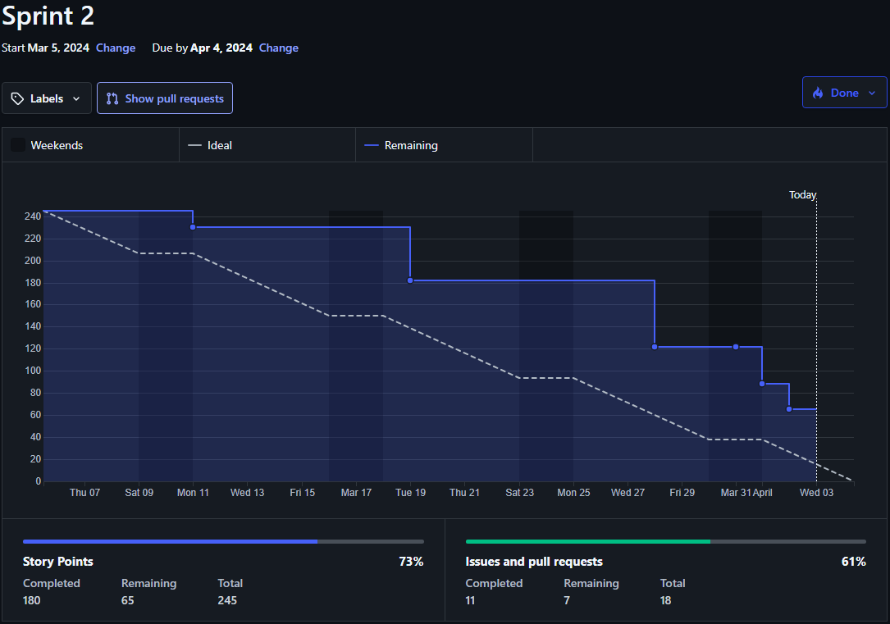
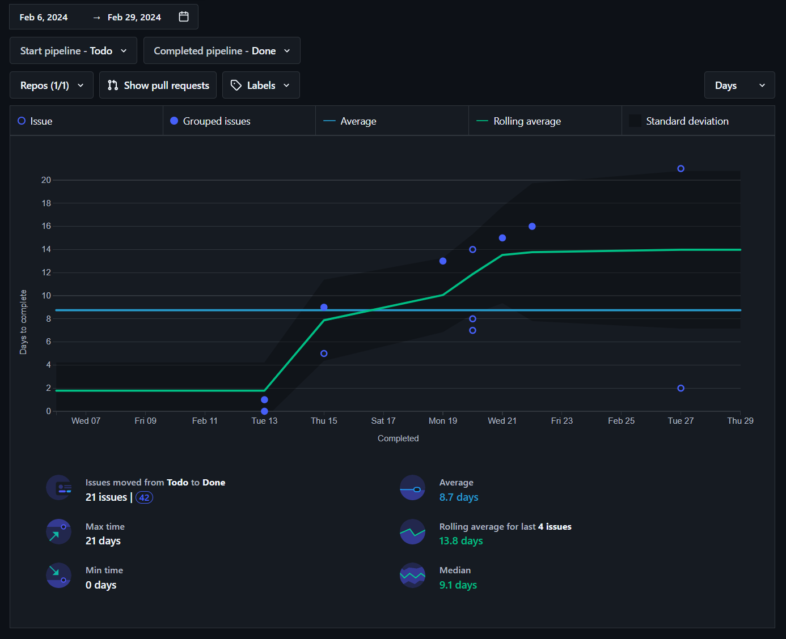
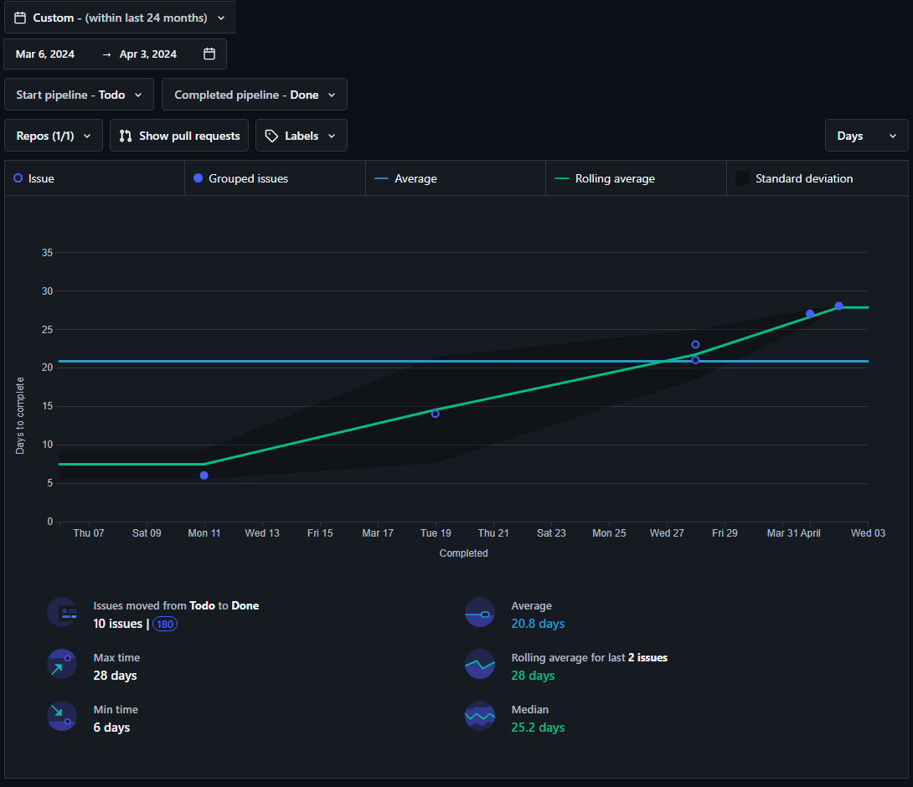
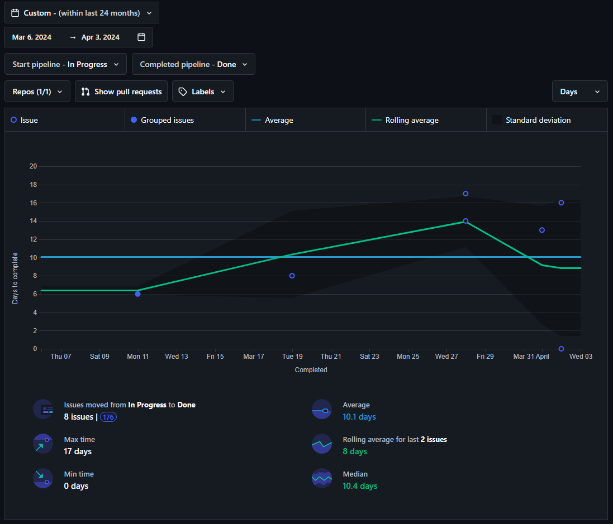

# **Metricas de Proceso Ágil y Recursos.**

    

---

## Índice

1. [Introducción](#1-introducción)
2. [Miembros Del Equipo De Trabajo](#2-miembros-del-equipo-de-trabajo)
3. [Gráfico Burn Down](#3-gráfico-burn-down)
    - [3.1 Sprint 1](#31-sprint-1)
    - [3.2 Sprint 2](#32-sprint-2)
4. [Gráfico De Control](#4-gráfico-de-control)
5. [Gráfico Lead Time](#5-gráfico-lead-time)
    - [5.1 Sprint 1](#51-sprint-1)
    - [5.2 Sprint 2](#52-sprint-2)
6. [Gráfico Cycle Time](#6-gráfico-cycle-time)
    - [6.1 Sprint 1](#61-sprint-1)
    - [6.2 Sprint 2](#62-sprint-2)
7. [Total De Puntos De Historia Entregados](#7-total-de-puntos-de-historia-entregados)
    - [7.1 Sprint 1](#71-sprint-1)
    - [7.2 Sprint 2](#72-sprint-2)
8. [Porcentaje De Puntos De Historia Entregados](#8-porcentaje-de-puntos-de-historia-entregados)
    - [8.1 Sprint 1](#81-sprint-1)
    - [8.2 Sprint 2](#82-sprint-2)
9. [Calendario Niko-Niko](#9-calendario-niko-niko)
    - [9.1 Sprint 2](#91-sprint-2)

---

## **1. Introducción**
En el presente informe técnico se presentarán gráficos relacionados con el desarrollo del primer sprint. Dichas gráficas mostrarán el progreso del equipo con respecto a las tareas planificadas para esta etapa. Además, se expondrán los resultados del sprint en términos de los puntos de historia completados.

Este informe proporciona al equipo una visión clara de su desempeño durante el sprint anterior, lo que les permite autoorganizarse de manera más efectiva para optimizar el trabajo planificado para la segunda entrega.

---

## **2. Miembros Del Equipo De Trabajo**
- Álvaro Chico Castellano.
- Jorge Muñoz Rodríguez.
- María José Ruíz Vázquez.
- Rafael Molina García.
- Rubén Pérez Garrido.

---

## **3. Gráfico Burn Down**
Un burn down chart es una herramienta visual utilizada en la gestión ágil de proyectos. La gráfica muestra el progreso del equipo hacia la finalización de las tareas planificadas en un período de tiempo específico. 

En el eje horizontal se encuentra el tiempo, representado en este caso en días, mientras que en el eje vertical se muestra la cantidad de trabajo restante, representado en este caso por puntos de historia estimados para cada tarea. 

El objetivo es que la línea de "burn down" (descenso) alcance cero hacia el final del período, lo que indica que se ha completado todo el trabajo planificado. Esto proporciona una visión rápida y clara del progreso del proyecto y permite que el equipo identifique rápidamente cualquier desviación en el ritmo planificado.

### **3.1 Sprint 1**

    

Al observar detenidamente el gráfico, se nota que el equipo logró finalizar todas las tareas planificadas antes de la conclusión del sprint 1. Sin embargo, es notorio que la mayoría de estas finalizaciones se concentraron en los últimos días del período. Este patrón sugiere que el equipo enfrentó ciertas dificultades para completar las tareas de manera constante a lo largo del sprint. Tal situación genera ciertas preocupaciones acerca de la calidad de la entrega, dado que casi la mitad de los puntos de historia fueron completados en el último día del sprint, lo que podría afectar la integridad y eficiencia del producto final.

### **3.2 Sprint 2**

    

Al observar detenidamente el gráfico, se puede observar que el equipo estuvo trabajando progresivamente y las tareas iban siendo completadas poco a poco. Por la estructura del sprint, los miembros que tenían asiganas las tareas de documentación tuvieron que esperar a que aquellos con las tareas de desarrollo acabasen, ya que gran parte de su trabajo dependía de ellos. Junto a esto, cabe destacar que el equipo relajó el ritmo de trabajo debido a la Semana Santa y la necesidad de repartir el tiempo para estudiar para otras asignaturas. Sin embargo, el equipo retomó de manera óptima el trabajo para así poder alcanzar sus objetivos propuestos.

Como se puede observar, a la hora de hacer la captura, el sprint no había terminado aún por lo que algunas tareas parecen no haberse completado, pero el equipo finalmente logró acabarlas todas.

---

## **4. Gráfico De Control**
El gráfico de control nos permite visualizar gráficamente el tiempo que una issue o tarea ha estado abierta, es decir, desde que fue definida y colocada en la columna "Todo" (si queremos medir el Lead Time) o en la columna "In Progress" (si queremos medir el Cycle Time), hasta que fue completada siguiendo la definición de hecho y movida a la columna "Done".

    

En el gráfico de control podemos ver que cada punto representa una o más issues completadas. Si el punto está relleno, este representa la completitud de más de una issue, mientras que si el punto no está relleno, indica que solo se cerró una issue.

En el eje horizontal podemos visualizar una secuencia de fechas que representan el día en el que la issue fue cerrada, mientras que en el eje vertical, podemos ver el número de días que tardó una issue en ser cerrada o movida a la columna "Done".

Dentro de la representación, se pueden observar dos líneas, una azul y una verde. La línea azul muestra el número promedio de días que se necesitan para cerrar una issue durante todo el período de tiempo seleccionado, mientras que la línea verde muestra un promedio móvil de la cantidad de días que se necesitan para cerrar las issues.

Finalmente, tenemos la zona grisácea que indica si una issue está dentro de los valores óptimos de duración para su completitud. Si una issue se encuentra fuera de esta zona, quiere decir que el tiempo que ha tomado en ser cerrada es extrañamente corto o largo.

---

## **5. Gráfico Lead Time**
El gráfico de control del lead time, nos permite visualizar gráficamente el tiempo que una issue o tarea ha estado abierta, es decir, desde que fue definida y colocada en la columna "Todo", hasta que fue completada siguiendo la definición de hecho y movida a la columna "Done".

### **5.1 Sprint 1**
En la imagen inferior, se puede observar que, el día 19 de Febrero, se completaron más de una issue tras haber pasado 13 días desde que se colocaron dichas tareas en la columna "Todo".

    

Con este gráfico podemos sacar las siguientes conclusiones:
- Se tardó una semana desde que las issues fueron colocadas en la columna "Todo" hasta que comenzaron a cerrarse, lo que indica que el equipo tardó en ponerse a trabajar.
- Junto a lo anterior, destaca que en los últimos días de desarrollo, el equipo estuvo durante 5 días sin completar ninguna issue.
- Pese a haber varias issues que se encuentran dentro de la zona de desviación estándar, se puede afirmar que el proyecto ha estado bajo control gran parte del tiempo.

### **5.2 Sprint 2** 

    

Con este gráfico podemos sacar las siguientes conclusiones:
- Como ya se mencionó anteriormente, el equipo se vio afectado por las tareas de desarrollo.
- Hubo problemas a la hora de mover las tareas en las columnas, como es el caso de la presente en el día 28 de Marzo, la cual se olvidó mover a la columna de "Done" y parece que se estuvo trabajando más tiempo de la cuenta en ella. Hay que tener mayor cuidado con estos despistes ya que pueden afectar a la forma de interpretar estos gráficos.
- Como se puede observar, la media de tiempo de la realización de la tarea es elevada, llegando a una media de casi un mes desde que se puso en el backlog, hasta que fue completada.
- Las issues completadas se encuentran todas dentro de la zona de desviación, por lo que en principio el equipo se ha mantenido con un ritmo de trabajo medio.
- El ascenso de la linea de media de tiempo de trabajo puede indicar que el equipo ha ido tardando cada vez más en terminar de completar las tareas conforme ha ido avanzando el sprint.

---

## **6. Gráfico Cycle Time**
El gráfico de control del cycle time, nos permite visualizar gráficamente el tiempo que una issue o tarea ha estado en progreso, es decir, desde que fue colocada en la columna "In Progress", hasta que fue completada siguiendo la definición de hecho y movida a la columna "Done".

### **6.1 Sprint 1**
En la imagen inferior, se puede observar que, el día 15 de Febrero, se completaron más de una issue tras haber pasado 2 días desde que se colocaron dichas tareas en la columna "In Progress".

    

Con este gráfico podemos sacar las siguientes conclusiones:
- Se tardó una semana desde que las issues fueron colocadas en la columna "Todo" hasta que comenzaron a ser desarrolladas, lo que indica que el equipo tardó en ponerse a trabajar.
- Varias issues se encuentran fuera de la zona de desviación estándar, esto pudo implicar que el equipo perdió en parte control del progreso, lo que puede llegar a causar problemas a la hora de predecir, planificar y estimar futuras issues.
- La presencia de un pico al final del desarrollo en la línea verde de promedio móvil, indica la presencia de un cuello de botella, lo que permite alertar al equipo sobre problemas en el proceso.

### **6.2 Sprint 2** 

    

Con este gráfico podemos sacar las siguientes conclusiones:
- El equipo ha tardado de media unos 10 días en completar las tareas, es decir, desde que se comienzan a desarrollar hasta que son 100% completadas. Este valor nos indica que el equipo ha estimado de forma correcta la carga de trabajo.
- Algunas de las issues resuletas que se encuentran en el límite de la zona de desviación típica, se ven en este lugar debido a un descuido a la hora de dejar la tarea en al columna "In Review" en vez de a la de "Done".
- Se puede apreciar como el ritmo de trabajo se vio disminuido en la parte media del sprint, pero finalmente el equipo retomó la constancia para poder completar todas las tareas propuestas.

---

## **7. Total De Puntos De Historia Entregados**

### **7.1 Sprint 1**
Como se evidencia claramente en el gráfico de Burn Down correspondiente al Sprint 1, el equipo ha alcanzado un su objetivo al completar todas las tareas previstas para este período. Esta hazaña demuestra la dedicación y la eficiencia del equipo en la ejecución de las actividades planificadas. Al alcanzar este objetivo, se confirma que el equipo ha logrado ejecutar y finalizar de manera exitosa los 81 puntos de historias que se habían estimado previamente para este sprint. Este logro no solo resalta la capacidad del equipo para trabajar de manera coordinada y cumplir con los objetivos establecidos, sino que también refleja una planificación efectiva y una gestión adecuada de los recursos disponibles. 

Este éxito permite al equipo aprender para poder mejorar en futuros sprints, facilitando así el camino para alcanzar las metas propuestas.

### **7.2 Sprint 2** 
El análisis del gráfico de Burn Down del Sprint 2 revela un cumplimiento exitoso de todos los objetivos establecidos a pesar de enfrentar desafíos significativos en el ritmo de trabajo en ciertos momentos. A pesar de estos obstáculos, el equipo ha demostrado su compromiso al completar todas las tareas planificadas para este período. Este logro subraya la capacidad del equipo para mantenerse enfocado en sus metas y superar las dificultades que puedan surgir durante el proceso. Al concluir todas las actividades propuestas, el equipo ha cumplido con éxito los 224 puntos de historia estimados para este sprint.

---

## **8. Porcentaje De Puntos De Historia Entregados**

### **8.1 Sprint 1**
Como hemos observado previamente con la finalización satisfactoria de los 81 puntos de historia en el Sprint 1, el equipo ha alcanzado un porcentaje de entrega del 100%. Este hito confirma que todas las historias planificadas para el sprint han sido completadas dentro del período previsto, reflejando la eficacia y el compromiso del equipo en la ejecución de las tareas asignadas.

### **8.2 Sprint 2** 
Como hemos observado previamente con la finalización satisfactoria de los 224 puntos de historia en el Sprint 2, el equipo ha alcanzado un porcentaje de entrega del 100%. Este hito confirma que todas las historias planificadas para el sprint han sido completadas dentro del período previsto, reflejando la eficacia y el compromiso del equipo en la ejecución de las tareas asignadas.

---

## **9. Calendario Niko-Niko**

### **9.1 Sprint 2**
El calendario Niko Niko es una herramienta utilizada en entornos ágiles, especialmente en metodologías como Scrum, para realizar un seguimiento visual del estado emocional del equipo a lo largo del tiempo.

Su funcionalidad principal es proporcionar una manera rápida y sencilla de visualizar la moral del equipo a lo largo del tiempo. Al registrar su estado de ánimo diariamente, los miembros del equipo pueden identificar patrones y tendencias en su bienestar emocional. Esto puede ayudar al equipo y al facilitador del proceso a detectar problemas o áreas de mejora en el ambiente de trabajo y tomar medidas para abordarlos.

El equipo ha tomado los siguientes elementos para representar diferentes estados emocionales y situaciones relacionadas con el trabajo diario del sprint 2. Estos emojis sirven como una forma rápida y visual de comunicar cómo ha ido el día en términos de desempeño, satisfacción y necesidades de ayuda, pero también indican si hubo problemas con el código propio o de otro compañero. Aquí está la explicación:

- 😊: Este emoji indica un estado positivo donde estás aprendiendo y disfrutando del trabajo. Aunque reconoces que necesitas esforzarte un poco, te sientes capaz de hacerlo sin problemas. Este emoji sugiere que todo ha ido bien y no has encontrado problemas significativos con tu código o el de otros compañeros.
- 😐: Representa un estado neutral donde sientes que tuviste que esforzarte, pero consideras que el día fue productivo. Aunque no todo fue perfecto, el trabajo asignado fue justo y te sientes satisfecho con el progreso. Esto implica que has enfrentado algunos desafíos, pero no han sido demasiado graves como para requerir ayuda o causar problemas importantes con el código.
- 😟: Indica un estado negativo donde sientes serias dificultades para cumplir la tarea o que la productividad de tu día fue terrible. Esto sugiere que has enfrentado problemas significativos en tu trabajo, ya sea con tu propio código o el de tus compañeros, lo que ha afectado tu desempeño y tu satisfacción.
- 😨: Este emoji refleja un estado de urgencia donde estás desesperado y necesitas ayuda. Esto implica que has encontrado problemas críticos con el código, ya sea el tuyo o el de otros, que necesitan ser abordados de inmediato para evitar problemas mayores o retrasos en el proyecto.
- "-": Indica que no se trabajó en el proyecto durante ese día. Este símbolo simplemente informa que no se participó en esa tarea específica en ese momento, sin indicar problemas con el código.
