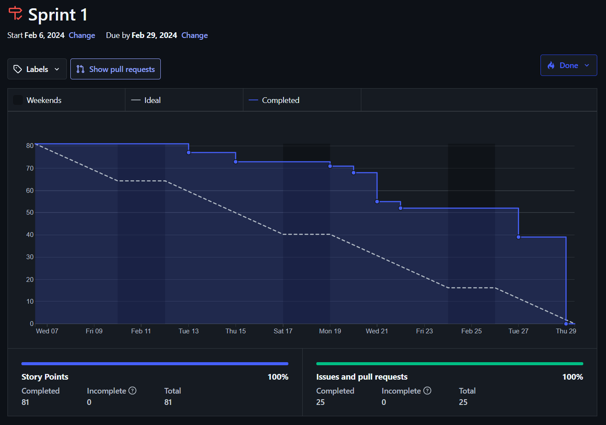
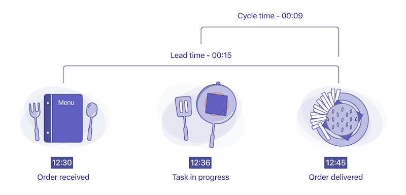
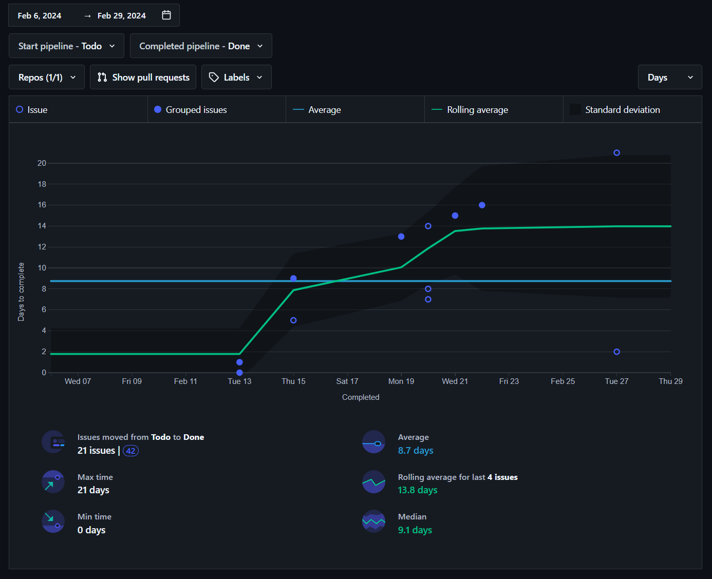
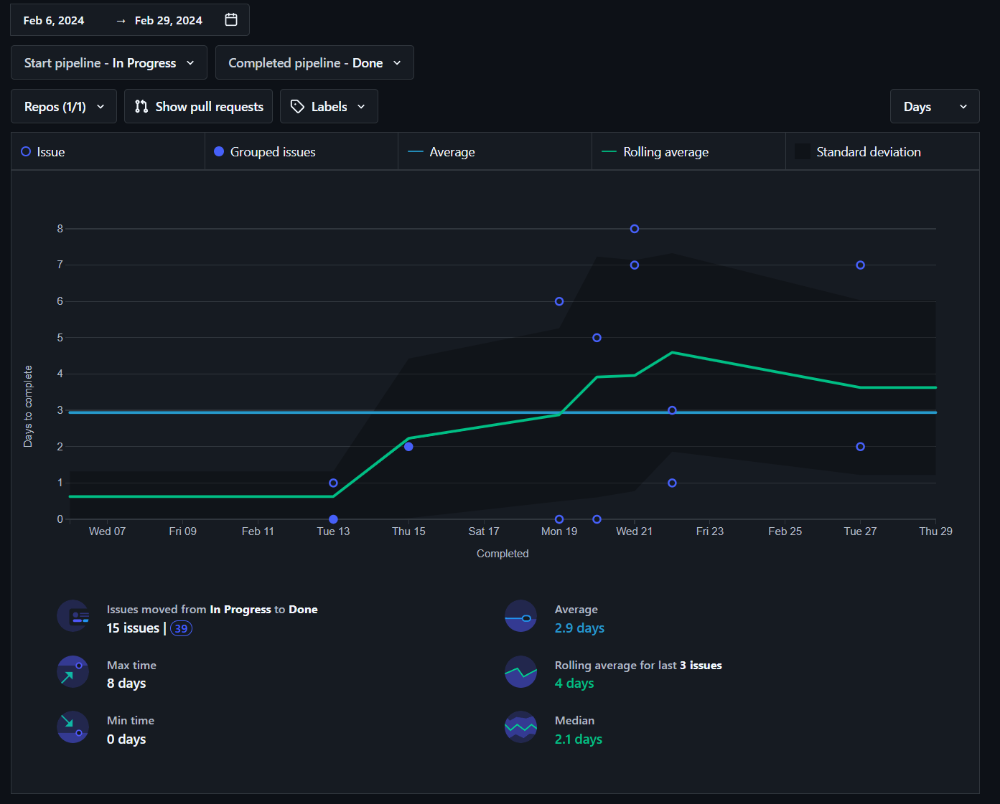

# **Metricas de Proceso Ágil y Recursos del Sprint 1.**

    

---

## Índice

1. [Introducción](#1-introducción)
2. [Miembros Del Equipo De Trabajo](#2-miembros-del-equipo-de-trabajo)
3. [Gráfico Burn Down](#3-gráfico-burn-down)
4. [Gráfico De Control](#4-gráfico-de-control)
5. [Gráfico Lead Time](#5-gráfico-lead-time)
6. [Gráfico Cycle Time](#6-gráfico-cycle-time)
7. [Total De Puntos De Historia Entregados](#7-total-de-puntos-de-historia-entregados)
8. [Porcentaje De Puntos De Historia Entregados](#8-porcentaje-de-puntos-de-historia-entregados)

---

## **1. Introducción**
En el presente informe técnico se presentarán gráficos relacionados con el desarrollo del primer sprint. Dichas gráficas mostrarán el progreso del equipo con respecto a las tareas planificadas para esta etapa. Además, se expondrán los resultados del sprint en términos de los puntos de historia completados.

Este informe proporciona al equipo una visión clara de su desempeño durante el sprint anterior, lo que les permite autoorganizarse de manera más efectiva para optimizar el trabajo planificado para la segunda entrega.

---

## **2. Miembros Del Equipo De Trabajo**
- Álvaro Chico Castellano.
- Jorge Muñoz Rodríguez.
- María José Ruíz Vázquez.
- Rafael Molina García.
- Rubén Pérez Garrido.

---

## **3. Gráfico Burn Down**
Un burn down chart es una herramienta visual utilizada en la gestión ágil de proyectos. La gráfica muestra el progreso del equipo hacia la finalización de las tareas planificadas en un período de tiempo específico, en este caso, el sprint 1. 

En el eje horizontal se encuentra el tiempo, representado en este caso en días, mientras que en el eje vertical se muestra la cantidad de trabajo restante, representado en este caso por puntos de historia estimados para cada tarea. 

El objetivo es que la línea de "burn down" (descenso) alcance cero hacia el final del período, lo que indica que se ha completado todo el trabajo planificado. Esto proporciona una visión rápida y clara del progreso del proyecto y permite que el equipo identifique rápidamente cualquier desviación en el ritmo planificado.

    

Al observar detenidamente el gráfico, se nota que el equipo logró finalizar todas las tareas planificadas antes de la conclusión del sprint. Sin embargo, es notorio que la mayoría de estas finalizaciones se concentraron en los últimos días del período. Este patrón sugiere que el equipo enfrentó ciertas dificultades para completar las tareas de manera constante a lo largo del sprint. Tal situación genera ciertas preocupaciones acerca de la calidad de la entrega, dado que casi la mitad de los puntos de historia fueron completados en el último día del sprint, lo que podría afectar la integridad y eficiencia del producto final.

---

## **4. Gráfico De Control**
El gráfico de control nos permite visualizar gráficamente el tiempo que una issue o tarea ha estado abierta, es decir, desde que fue definida y colocada en la columna "Todo" (si queremos medir el Lead Time) o en la columna "In Progress" (si queremos medir el Cycle Time), hasta que fue completada siguiendo la definición de hecho y movida a la columna "Done".

    

En el gráfico de control podemos ver que cada punto representa una o más issues completadas. Si el punto está relleno, este representa la completitud de más de una issue, mientras que si el punto no está relleno, indica que solo se cerró una issue.

En el eje horizontal podemos visualizar una secuencia de fechas que representan el día en el que la issue fue cerrada, mientras que en el eje vertical, podemos ver el número de días que tardó una issue en ser cerrada o movida a la columna "Done".

Dentro de la representación, se pueden observar dos líneas, una azul y una verde. La línea azul muestra el número promedio de días que se necesitan para cerrar una issue durante todo el período de tiempo seleccionado, mientras que la línea verde muestra un promedio móvil de la cantidad de días que se necesitan para cerrar las issues.

Finalmente, tenemos la zona grisácea que indica si una issue está dentro de los valores óptimos de duración para su completitud. Si una issue se encuentra fuera de esta zona, quiere decir que el tiempo que ha tomado en ser cerrada es extrañamente corto o largo.

---

## **5. Gráfico Lead Time**
El gráfico de control del lead time, nos permite visualizar gráficamente el tiempo que una issue o tarea ha estado abierta, es decir, desde que fue definida y colocada en la columna "Todo", hasta que fue completada siguiendo la definición de hecho y movida a la columna "Done".

Por ejemplo, podemos observar en la imagen inferior que el día 19 de Febrero, se completaron más de una issue tras haber pasado 13 días desde que se colocarondichas tareas en la columna "Todo".

    

Con este gráfico podemos sacar las siguientes conclusiones:
- Se tardó una semana desde que las issues fueron colocadas en la columna "Todo" hasta que comenzaron a cerrarse, lo que indica que el equipo tardó en ponerse a trabajar.
- Junto a lo anterior, destaca que en los últimos días de desarrollo, el equipo estuvo durante 5 días sin completar ninguna issue.
- Pese a haber varias issues que se encuentran dentro de la zona de desviación estándar, se puede afirmar que el proyecto ha estado bajo control gran parte del tiempo.

---

## **6. Gráfico Cycle Time**
El gráfico de control del cycle time, nos permite visualizar gráficamente el tiempo que una issue o tarea ha estado en progreso, es decir, desde que fue colocada en la columna "In Progress", hasta que fue completada siguiendo la definición de hecho y movida a la columna "Done".

Por ejemplo, podemos observar en la imagen inferior que el día 15 de Febrero, se completaron más de una issue tras haber pasado 2 días desde que se colocaron dichas tareas en la columna "In Progress".

    

Con este gráfico podemos sacar las siguientes conclusiones:
- Se tardó una semana desde que las issues fueron colocadas en la columna "Todo" hasta que comenzaron a cerrarse, lo que indica que el equipo tardó en ponerse a trabajar.
- Varias issues se encuentran fuera de la zona de desviación estándar, esto pudo implicar que el equipo perdió en parte control del progreso, lo que puede llegar a causar problemas a la hora de predecir, planificar y estimar futuras issues.
- La presencia de un pico al final del desarrollo en la línea verde de promedio móvil, indica la presencia de un cuello de botella, lo que permite alertar al equipo sobre problemas en el proceso.

---

## **7. Total De Puntos De Historia Entregados**
Como se evidencia claramente en el gráfico de Burn Down correspondiente al Sprint 1, el equipo ha alcanzado un su objetivo al completar todas las tareas previstas para este período. Esta hazaña demuestra la dedicación y la eficiencia del equipo en la ejecución de las actividades planificadas. Al alcanzar este objetivo, se confirma que el equipo ha logrado ejecutar y finalizar de manera exitosa los 81 puntos de historias que se habían estimado previamente para este sprint. Este logro no solo resalta la capacidad del equipo para trabajar de manera coordinada y cumplir con los objetivos establecidos, sino que también refleja una planificación efectiva y una gestión adecuada de los recursos disponibles. 

Este éxito permite al equipo aprender para poder mejorar en futuros sprints, facilitando así el camino para alcanzar las metas propuestas.

---

## **8. Porcentaje De Puntos De Historia Entregados**
Como hemos observado previamente con la finalización satisfactoria de los 81 puntos de historia en el Sprint 1, el equipo ha alcanzado un porcentaje de entrega del 100%. Este hito confirma que todas las historias planeadas para el sprint han sido completadas dentro del período previsto.
