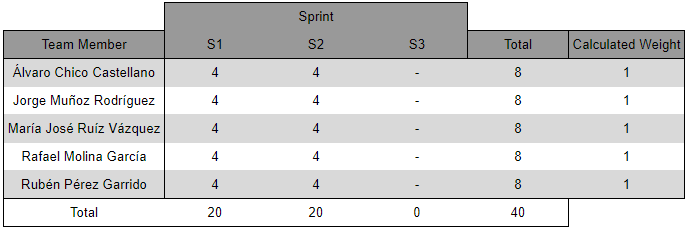

# **Sprint Retrospective**

    

---

## Índice

1. [Introducción](#1-introducción)
2. [Miembros Del Equipo De Trabajo](#2-miembros-del-equipo-de-trabajo)
3. [Evaluación De Los Métodos Del Equipo Y Posibles Mejoras](#3-evaluacion-de-los-metodos-del-equipo-y-posibles-mejoras)
4. [Evaluación De Las Capacidades Y Posibles Mejoras De Los Miembos](#4-evaluacion-de-las-capacidades-y-posibles-mejoras-de-los-miembros)
5. [Plan De Acción](#5-plan-de-accion)
6. [Tabla De Rendimiento](#6-tabla-de-rendimiento)

---

## **1. Introducción**
El siguiente documento detalla la planificación y organización del trabajo para el segundo sprint, estableciendo las tareas a realizar, los responsables de cada tarea y su respectivo tiempo estimado. En él, se presenta una visión clara y estructurada de las actividades que se abordarán durante el período del sprint, lo que facilita la coordinación y el seguimiento del progreso del equipo de desarrollo.

---

## **2. Miembros Del Equipo De Trabajo**
- Álvaro Chico Castellano.
- Jorge Muñoz Rodríguez.
- María José Ruíz Vázquez.
- Rafael Molina García.
- Rubén Pérez Garrido.

---

## **3. Evaluación De Los Métodos Del Equipo Y Posibles Mejoras**
En este apartado se analizarán las mejoras que fueron propuestas por el equipo tras la finalización del primer sprint, con el objetivo de verificar que se esté avanzando y se tengan en cuenta las ideas que se quisieron imponer. Estos son los resultados:
- **Implementar reuniones más frecuentes:**
- **Establecer roles y responsabilidades más claros dentro del equipo:**
- **Establecer objetivos claros y medibles para cada sprint:**
- **Mejorar la gestión del tiempo durante las reuniones y actividades grupales:**
- **Mejorar la repartición de tareas:**

---

## **4. Evaluación De Las Capacidades Y Posibles Mejoras De Los Miembos**
En este apartado se analizarán las mejoras que fueron propuestas por algunos miembros del equipo tras la finalización del primer sprint, con el objetivo de que otros integrantes puedan mejorar su rendimiento. Se verificará que se esté avanzando y se hayan tenido en cuenta las ideas que se quisieron imponer. Estos son los resultados:
- **Mejorar la gestión del tiempo para cumplir con los plazos establecidos:** 
- **Mejorar la capacidad para recibir y aplicar la retroalimentación de manera constructiva:** 

---

## **5. Plan de Acción**
El siguiente plan de acción tiene como objetivo identificar acciones concretas para mejorar el desempeño y la eficiencia del equipo. Se estructura en tres columnas: Start, Stop y Continue Doing. En cada columna, se detallarán las actividades que el equipo debe iniciar, dejar de realizar y mantener, respectivamente. Este plan permitirá al equipo enfocarse en las áreas clave para maximizar su rendimiento y lograr los objetivos establecidos. Todo ello se basará en las propuestas del equipo tras la conclusión del sprint 2, teniendo en cuenta además los resultados de los análisis de los puntos anteriores.
### Start:
- 

### Stop:
- 

### Continue Doing:
- 

---

## **6. Tabla De Rendimiento**
En este punto se aborda la evaluación del desempeño individual en tres pasos: calificación individual, recopilación de puntuaciones y discusión para consensuar las calificaciones finales. Tras una revisión justa del desempeño durante este sprint, se ha decidido asignar a todos los miembros del equipo la misma puntuación final debido a su contribución equitativa al proyecto. Esta es la tabla de rendimiento final para este segundo sprint.

    

