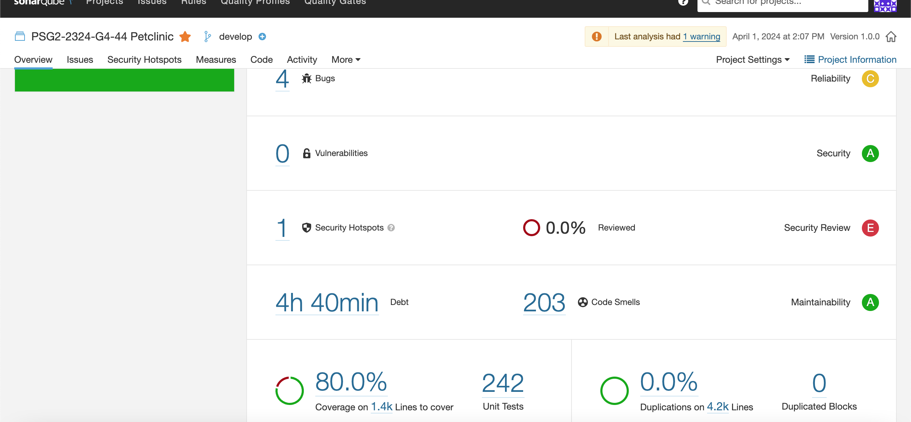
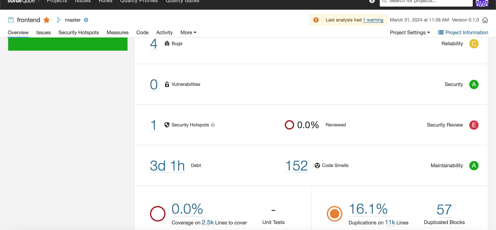
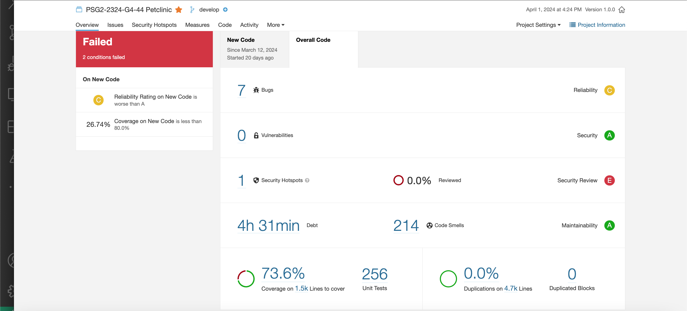
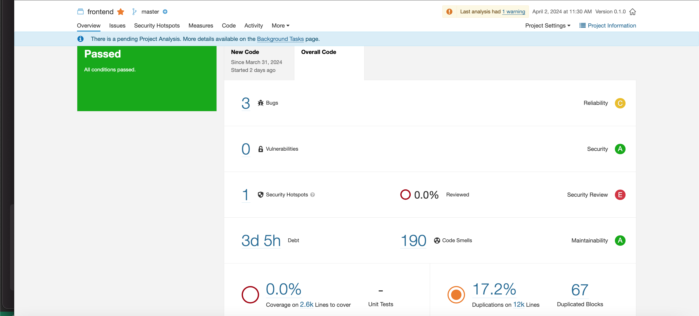

# **Ánalis del Código fuente y Métricas Asociadas.**

    

---

## Índice

1. [Introducción](#1-introducción)
2. [Miembros Del Equipo De Trabajo](#2-miembros-del-equipo-de-trabajo)
3. [Ánalisis Código fuente y Métricas Asociadas al Sprint 1](#3-ánalisis-código-fuente-y-métricas-asociadas-al-sprint-1)
    - [3.1 SonarQube Dashboard Backend y Frontend(métricas y clásificación)](#31-sonarqube-dashboard)
    - [3.2 Potencial Bugs](#32-potencial-bugs)
    - [3.3 Code Smell Found](#33-code-smell-found)
4. [Ánalisis Código fuente y Métricas Asociadas al Sprint 2](#4-ánalisis-código-fuente-y-métricas-asociadas-al-sprint-2)
    - [4.1 SonarQube Dashboard Backend y Frontend(métricas y clásificación)](#41-sonarqube-dashboard)
    - [4.2 Potencial Bugs](#42-potencial-bugs)
    - [4.3 Code Smell Found](#43-code-smell-found)
5. [Conclusiones](#5-conclusiones)

---

## **1. Introducción**
El propósito de este informe es realizar un análisis detallado del estado del proyecto mediante el análisis de ciertas métricas específicas, con el fin de proporcionar una visión clara del progreso realizado hasta el momento. La medición de un proyecto es fundamental, ya que los datos recopilados pueden ser utilizados para mejorar la calidad del código, reducir el tiempo y esfuerzo dedicado a corregir errores, y contribuir a la reducción de la deuda técnica desde las primeras etapas del proyecto.

En primer lugar, se presentará una vista en SonarQube que detalla las diferentes métricas del código desarrollado durante el Sprint 1, junto con las calificaciones correspondientes. Posteriormente, se analizarán las métricas correspondientes al Sprint 2, proporcionando así una comparativa de los avances realizados en ambos periodos de desarrollo.

En cada uno de los análisis de los sprints, se presentará un detallado examen de los errores y los "code smells" que han surgido. Aunque es común encontrar un número considerable de "code smells", esto se debe a que algunos pueden repetirse en diferentes secciones del código. Por lo tanto, nos enfocaremos en describir y evaluar cada uno de ellos una sola vez para evitar redundancias y proporcionar una visión más clara y concisa del estado del proyecto.

---

## **2. Miembros Del Equipo De Trabajo**
- Álvaro Chico Castellano.
- Jorge Muñoz Rodríguez.
- María José Ruíz Vázquez.
- Rafael Molina García.
- Rubén Pérez Garrido.

---

## **3. Ánalisis Código fuente y Métricas Asociadas al Sprint 1**
### **3.1 SonarQube Dashboard**

    

El dashboard proporciona una visión general del estado del código fuente del sprint 1 de nuestro proyecto desde el punto de vista de la calidad y seguridad del software. Este dashboard muestra métricas y estadísticas clave sobre el código, como el número de problemas de calidad, la cobertura del código, la duplicación de código, la complejidad ciclomática, entre otros.

Análisis de las metricas del Backend

- Bugs: Representa errores en el código que pueden causar un comportamiento incorrecto o inesperado en el programa. Tener 4 bugs ("Call "Optional#isPresent()" before accessing the value") indica que hay 4 partes del código que pueden provocar errores en el funcionamiento del software. Es importante solucionar estos bugs para mejorar la calidad y estabilidad del sistema. 

- Vulnerabilities: Se refiere a debilidades en el código que podrían ser explotadas por un atacante para comprometer la seguridad del sistema. Tener 0 vulnerabilidades es ideal, ya que significa que el código no tiene puntos débiles conocidos que puedan ser aprovechados por atacantes.

- Security Hotspots: Representa áreas del código que podrían contener vulnerabilidades o problemas de seguridad potenciales. Tener 1 security hotspot indica que hay una zona identificada como potencialmente vulnerable, pero no necesariamente significa que haya una vulnerabilidad activa.

- Debt (Deuda técnica): Es una medida del esfuerzo requerido para solucionar problemas técnicos en el código. En este caso, 4h40min de deuda técnica sugiere que se necesitaría aproximadamente 4 horas y 40 minutos para abordar todos los problemas técnicos identificados en el código.

- Coverage (Cobertura de código): Indica qué porcentaje del código base está cubierto por pruebas unitarias. Un 80% de cobertura de código es bastante bueno, ya que indica que la mayoría del código ha sido probado, pero siempre es posible mejorar la cobertura para garantizar una mayor confiabilidad del software.

- Test Unitarios: Indica la cantidad de pruebas unitarias que se han creado para el código. Tener 242 pruebas unitarias sugiere un esfuerzo significativo en la escritura de pruebas para validar el comportamiento del código, lo cual es positivo para la calidad del software.

- Duplications (Duplicaciones): Indica el porcentaje de código duplicado en el proyecto. Tener 0% duplicaciones sugiere que no se han encontrado secciones de código idénticas o muy similares, lo cual es beneficioso para mantener un código limpio y fácil de mantener.
  
- Code Smells (Olor a código): Son patrones de diseño o estructuras de código que pueden ser indicativos de un diseño deficiente y que pueden llevar a problemas en el futuro. Tener 203 code smells sugiere que hay muchas áreas en el código que podrían beneficiarse de una refactorización para mejorar su calidad y mantenibilidad.
  
Clasificación de los code smells:
  
- Bloaters (Los inflados o gigantes):
    - Remove this unused import 'java.util.Optional'.
    - Remove this unused import 'java.util.List'.
    - Remove this unused import 'org.hibernate.annotations.OnDelete'.
    - Remove this unused import 'java.util.Map'.
    - Remove this commented out code.
    - Remove the parentheses around the "headers" parameter.
    - Remove the parentheses around the "frameOptions" parameter.
    - Remove the parentheses around the "exepciontHandling" parameter.
    - This block of commented-out lines of code should be removed.
    - Remove this unnecessary cast to "List".
    - Remove this unused "p" local variable.
    - Remove the declaration of thrown exception 'java.net.URISyntaxException', as it cannot be thrown from method's body.

- Diseño orientado a objetos:
    - Replace this lambda with a method reference.
    - Replace the type specification in this constructor call with the diamond operator ("<>").

- Los preventores de cambios:
    - Inject this field value directly into "configure", the only method that uses it.
    - Make this "expected" field final.

- Prescindibles o dispensables:
    - Declare this local variable with "var" instead.
    - Replace this use of System.out or System.err by a logger.

- Los acopladores (Couplers):
D    - Declare "current" on a separate line.

 

    

Análisis de las métricas del frontend

- Bugs: como hemos nombrado en el backend tener 4 bugs indica que hay 4 partes del código que pueden provocar errores en el funcionamiento del software. Es importante solucionar estos bugs para mejorar la calidad y estabilidad del sistema.

- Vulnerabilities: tener 0 vulnerabilidades es ideal, ya que significa que el código no tiene puntos débiles conocidos que puedan ser aprovechados por atacantes.

- Security Hotspots: tener 1 security hotspot indica que hay una zona identificada como potencialmente vulnerable, pero no necesariamente significa que haya una vulnerabilidad activa.

- Debt (Deuda técnica): en este caso, 3 días y 1 hora de deuda técnica sugiere que se necesitaría aproximadamente ese tiempo para abordar todos los problemas técnicos identificados en el código.

- Code Smells (Olor a código): tener 152 code smells sugiere que hay muchas áreas en el código que podrían beneficiarse de una refactorización para mejorar su calidad y mantenibilidad.

- Coverage (Cobertura de código): tener un 0% de cobertura de código significa que no hay pruebas unitarias que cubran el código, lo que deja al sistema vulnerable a errores no detectados.

- Duplications (Duplicaciones): tener un 16.1% de duplicaciones sugiere que una parte significativa del código se ha duplicado, lo que puede llevar a problemas de mantenimiento y dificultar la comprensión del código.

- Duplicated Blocks (Bloques duplicados): indica la cantidad de bloques de código duplicados en el proyecto. Tener 57 bloques duplicados muestra que hay múltiples secciones de código que son idénticas o muy similares, lo que indica una posible necesidad de refactorización para eliminar la duplicación y mejorar la mantenibilidad del código.

### **3.2 Potencial Bugs**
Se han encontrado 4 bugs del mismo tipo en diferentes clases del proyecto, se dará una descripción, causa, evaluación y solución de este error de forma general.

- Call "Optional#isPresent()" before accessing the value.

  - Descripción: El error Call "Optional#isPresent()" before accessing the value“ indica que se está intentando acceder directamente al valor dentro de un objeto Optional din verificar primero si el objeto contiene un valor.

  - Causas: la principal causa es la falta de comprobación de la presencia del valor dentro del objeto Optional antes de acceder a él. Si el objeto está vació y se intenta acceder a él provocará una excepción.

  - Evaluación: En muchos casos, este error puede no causar un comportamiento erróneo inmediato, especialmente si se garantiza que el Optional siempre está presente antes de acceder a su valor. Sin embargo, omitir la verificación de la presencia del Optional puede conducir a excepciones NoSuchElementException en tiempo de ejecución si el Optional está vacío en algún momento durante la ejecución del programa.

  - Solución: una forma de corregir este error es agregar una comprobación utilizando el método “ inPresent()” antes de intentar acceder al valor.

### **3.3 Code Smell Found**

Una de las métricas derivadas del análisis de nuestro código del sprint 1 muestra 203 "code smells", aunque tras un examen más detallado se ha identificado que alrededor de 20 de ellos se repiten en diversas secciones del código. Por lo tanto, se ha generado un listado con estos 20 "code smells" para su posterior análisis en profundidad. A continuación, se presentará un detallado análisis de cada uno de estos "code smells" para comprender mejor su naturaleza y determinar las acciones correctivas necesarias.

Se han encontrado estos 4 code smell similares sobre clases diferentes por lo que haremos un análisis general del mismo.
- Remove this unused import 'java.util.Optional'.
- Remove this unused import 'java.util.List'.
- Remove this unused import 'org.hibernate.annotations.OnDelete'.
- Remove this unused import 'java.util.Map'.

  - Descripción: El code smell “ Remove this unused import ‘ {clase}’ ” hace referencia a la importación de una clase que no se está utilizando en el código fuente. Importar clases o paquetes innecesarios dificulta a los desarrolladores y aumenta el tiempo de compilación.

  - Causas: La causa más común de este tipo de code smell es que el código ha sido modificado o refactorizado y algunas importaciones que antes eran necesarias dejan de serlo.

  - Evaluación: en ocasiones las herramientas de análisis de código detectan importaciones no utilizadas, ayudando a mejorar la flexibilidad del código.

  - Solución: para corregirlo es tan simple como eliminar la línea de código donde se importa el código o paquete no usado.

- Remove this commented out code.

  - Descripción: se refiere a secciones de código que están comentadas pero no se utilizan en ninguna parte del programa. Dificultando la lectura y comprensión del código, así como desorden en el mismo.

  - Causas: en ocasiones el código comentado se deja como una referencia o como una alternativa a una implementación existente.

  - Evaluación: existen varias formas de detección, de forma manual revisando el código fuente en busca de secciones comentadas que no se utilizan o mediante herramientas de análisis de código que identifique automáticamente este problema.

  - Solución: eliminar por completo el código comentado.  Aunque en ocasiones se trata de código antiguo que podría ser útil para futuras referencias, en este caso se debería mover a un sistema de control de versiones o a un archivo de respaldo.

Se han encontrado estos 3 code smell similares sobre parámetros diferentes por lo que haremos un análisis general del mismo.

- Remove the parentheses around the "headers" parameter
- Remove the parentheses around the "frameOptions" parameter
- Remove the parentheses around the "exepciontHandling" parameter

  - Descripción: tener paréntesis alrededor de un parámetro, como "headers","frameOptions", "exepciontHandling"  se refiere a un estilo de código que sugiere que los paréntesis son innecesarios y pueden ser eliminados sin afectar la semántica del código.

  - Causas: generalmente se produce debido a una convención de estilo de codificación o a la falta de conocimiento sobre la convención de estilo en el proyecto.

  - Evaluación: puede ser detectado manualmente al revisar el código fuente en busca de paréntesis alrededor de parámetros que no los necesitando por herramientas que aplican reglas de estilo específicas. 

  - Solución:La solución consiste en eliminar los paréntesis alrededor del parámetro, siguiendo el estilo elegido en el proyecto.

- Provide the parametrized type for this generic.

  - Descripción: Cuando se utiliza un tipo genérico en Java, es importante especificar el tipo de datos que se utilizará. No proporcionar este tipo parametrizado puede hacer que el código sea menos seguro y más difícil de entender.

  - Causas: suele ser la omisión accidental o la falta de comprensión sobre cómo funcionan los tipos genéricos en Java.

  - Evaluación: se puede detectar revisando el código fuente en busca de instancias de tipos genéricos sin un tipo parametrizado especificado o con herramientas de análisis que aplican reglas específicas relacionadas con el uso de tipos genéricos.

  - Solución: proporcionar el tipo parametrizado para el tipo genérico, especificando el tipo de datos que se utilizará con ese tipo genérico.   

- Declare this local variable with "var" instead.

  - Descripción: declarar una variable local con ‘var’ en Java se refiere a la omisión de la palabra clave ‘var’ al declarar variables locales donde su tipo se puede deducir  fácilmente.

  - Causas: falta de conocimiento sobre la palabra clave ‘var’ en Java o por preferencias personales o convenciones de estilo.

  - Evaluación: puede ser detectado revisando el código fuente en busca de variables locales donde el tipo se puede intuir fácilmente a partir de la expresión utilizada para inicializar la variable. 

  - Solución: utilizar la palabra clave var para declarar variables locales donde el tipo se puede deducir fácilmente a partir del contexto.

- Replace this lambda with a method reference.

  - Descripción: reemplazar una lambda con una referencia a un método sugiere que la lambda utilizada puede ser reemplazada por una referencia a un método existente.

  - Causas: falta de conocimiento sobre las referencias a métodos en Java o por no considerar la posibilidad de utilizar una referencia a método en lugar de una lambda.

  - Evaluación: puede ser identificado revisando el código fuente en busca de lambdas que simplemente llaman a métodos existentes. 

  - Solución: La solución consiste en reemplazar la lambda con una referencia a método cuando sea posible y apropiado.

- Replace the type specification in this constructor call with the diamond operator ("<>").

  - Descripción: reemplazar la especificación de tipo en una llamada al constructor con el operador diamante ("<>") sugiere que se puede utilizar el operador diamante para inferir el tipo del constructor en lugar de especificarlo explícitamente.

  - Causas: puede ser causado por la falta de conocimiento sobre el operador diamante en Java o por no considerar la posibilidad de utilizarlo para simplificar la sintaxis.

  - Evaluación: puede ser identificado revisando el código fuente en busca de llamadas a constructores de clases genéricas donde el tipo del constructor se especifica explícitamente.

  - Solución: reemplazar la especificación de tipo en la llamada al constructor con el operador diamante ("<>").

- Replace this use of System.out or System.err by a logger.

  - Descripción: reemplazar el uso directo de System.out o System.err por un registro (logger) se refiere a la práctica de utilizar un framework de registro de mensajes (como SLF4J con Logback o Log4j) en lugar de imprimir mensajes directamente en la consola estándar o el flujo de error estándar. 

  - Causas: falta de conocimiento sobre los sistemas de registro de mensajes o por la simplicidad inicial del código que lleva a la impresión directa de mensajes en la consola estándar o el flujo de error estándar.

  - Evaluación:  puede ser identificado revisando el código en busca de llamadas directas a System.out.println() o System.err.println().

  - Solución: reemplazar el uso directo de System.out o System.err por un sistema de registro de mensajes adecuado, como SLF4J con Logback o Log4j.

- Inject this field value directly into "configure", the only method that uses it.

  - Descripción: introducir directamente un valor en un método, particularmente en el único método que lo utiliza, es decir, que el valor podría ser pasado como un parámetro al método en lugar de ser almacenado en un campo de la clase.

  - Causas: realizar un diseño inicial que no considera la necesidad de pasar valores como parámetros a métodos, o por una refactorización incompleta que dejó el valor como un campo de clase cuando debería haber sido pasado como parámetro.

  - Evaluación: puede ser identificado revisando el código en busca de valores de campo que solo se utilizan en un método específico.

  - Solución: pasar el valor como un parámetro al método en lugar de almacenarlo como un campo de clase.

- Remove this unnecessary cast to "List"

  - Descripción: eliminar una conversión innecesaria a "List", se refiere a un caso en el que se realiza una conversión a "List" cuando no es necesario. Esto puede ocurrir cuando ya se tiene una referencia a un objeto que implementa la interfaz "List" y no se necesita convertirlo explícitamente.

  - Causas: puede ocurrir debido a la falta de comprensión sobre el tipo de datos o interfaces utilizadas en el código, o puede ser simplemente un error humano.

  - Evaluación:  se puede detectar revisando el código en busca de conversiones innecesarias a "List".

  - Solución: eliminar la conversión innecesaria a "List" cuando ya se tiene una referencia de "List".

- Remove this unused "p" local variable.

  - Descripción: eliminar una variable local no utilizada se refiere a que existen variables locales que se declaran pero no se utilizan en el código. Estas variables no aportan valor al programa y pueden dificultar la comprensión del mismo.

  - Causas: por cambios en la lógica del programa que dejan variables no utilizadas, o por errores de programación donde se olvida eliminar una variable después de realizar cambios en el código. 

  - Evaluación: se puede detectar mediante una revisión manual del código en busca de variables locales que no se utilicen en ninguna parte del programa o con herramientas específicas.

  - Solución: eliminar la variable local no utilizada.

- Declare "current" on a separate line.

  - Descripción: se refiere a la práctica de declarar múltiples variables en una sola línea, lo cual puede dificultar la legibilidad del código.

  - Causas: una preferencia personal del desarrollador o por la falta de conocimiento sobre las mejores prácticas de codificación que sugieren la declaración de variables en líneas separadas.

  - Evaluación: se puede detectar revisando el código en busca de declaraciones de variables que incluyen múltiples variables en la misma línea.

  - Solución: consiste en declarar cada variable en una línea separada, lo que mejora la legibilidad del código y facilita su comprensión.

- Make this "expected" field final.

  - Descripción: se refiere a convertir un campo que no cambia después de la inicialización en una constante final.

  - Causas: ocurre cuando un campo no se declara como final inicialmente, ya sea debido a un error humano o a una falta de atención al diseño del código.

  - Evaluación: se puede detectar revisando el código en busca de campos que no cambian su valor después de la inicialización pero que no se han declarado como final. 

  - Solución: consiste en agregar la palabra clave "final" al campo "expected" para indicar que su valor no cambiará después de la inicialización.

- Remove the declaration of thrown exception 'java.net.URISyntaxException', as it cannot be thrown from method's body.

  - Descripción: se refiere a la presencia de una declaración de excepción de un método que no puede ser lanzada realmente por el código dentro del cuerpo del método.

  - Causas: puede ocurrir debido a un error humano al declarar las excepciones sin considerar si realmente pueden ser lanzadas desde el cuerpo del método.

  - Evaluación: se puede detectar revisando el método en busca de excepciones declaradas que no se lancen realmente desde el cuerpo del método.

  - Solución: eliminar la declaración de la excepción si no puede ser lanzada desde el cuerpo del método.

---

## **4. Ánalisis Código fuente y Métricas Asociadas al Sprint 2**
### **4.1 SonarQube Dashboard**

    

El dashboard proporciona una visión general del estado del código fuente del sprint 2 de nuestro proyecto desde el punto de vista de la calidad y seguridad del software. Este dashboard muestra métricas y estadísticas clave sobre el código, como el número de problemas de calidad, la cobertura del código, la duplicación de código, la complejidad ciclomática, entre otros.

Análisis de las métricas del backend

- Bugs: tener 7 bugs indica que hay 7 partes del código que pueden provocar errores en el funcionamiento del software. Es importante solucionar estos bugs para mejorar la calidad y estabilidad del sistema.

- Vulnerabilities: tener 0 vulnerabilidades es ideal, ya que significa que el código no tiene puntos débiles conocidos que puedan ser aprovechados por atacantes.

- Security Hotspots: tener 1 security hotspot indica que hay una zona identificada como potencialmente vulnerable, pero no necesariamente significa que haya una vulnerabilidad activa.

- Debt (Deuda técnica):. En este caso, 4 horas y 31 minutos de deuda técnica sugiere que se necesitaría aproximadamente ese tiempo para abordar todos los problemas técnicos identificados en el código.

- Coverage (Cobertura de código): un 73.6% de cobertura de código es bastante bueno, ya que indica que la mayoría del código ha sido probado, lo que aumenta la confiabilidad del software.

- Test Unitarios: tener 256 pruebas unitarias sugiere un esfuerzo significativo en la escritura de pruebas para validar el comportamiento del código, lo cual es positivo para la calidad del software.

- Code Smells (Olor a código): tener 214 code smells sugiere que hay muchas áreas en el código que podrían beneficiarse de una refactorización para mejorar su calidad y mantenibilidad.
  
Clasificación de los Code smells:
  
- Bloaters (Los inflados o gigantes):
    - Remove this unused import 'org.springframework.samples.petclinic.owner.Owner'.
    - Remove this commented out code.
    - Remove the parentheses around the "headers" parameter.
    - Remove the parentheses around the "frameOptions" parameter.
    - Remove the parentheses around the "exepciontHandling" parameter.
    - Remove this unnecessary cast to "List".

- Diseño orientado a objetos:
    - Replace this lambda with a method reference.
    - Replace the type specification in this constructor call with the diamond operator ("<>").
    - Declare "current" on a separate line.

- Los preventores de cambios:
    - Inject this field value directly into "configure", the only method that uses it.
    - Complete the task associated to this TODO comment.

- Prescindibles o dispensables:
    - Declare this local variable with "var" instead.
    - Replace this use of System.out or System.err by a logger.

- Los acopladores (Couplers):
    - Use already-defined constant 'OWNER' instead of duplicating its value here.

- Otros:
    - Use the primitive boolean expression here.
    - Remove the unnecessary boolean literal.

    

Análisis de las métricas del frontend

- Bugs: Tener 3 bugs indica que hay 3 partes del código que pueden provocar errores en el funcionamiento del software. Es importante solucionar estos bugs para mejorar la calidad y estabilidad del sistema.

- Vulnerabilities: Tener 0 vulnerabilidades es ideal, ya que significa que el código no tiene puntos débiles conocidos que puedan ser aprovechados por atacantes.

- Security Hotspots:Tener 1 security hotspot indica que hay una zona identificada como potencialmente vulnerable, pero no necesariamente significa que haya una vulnerabilidad activa.

- Debt (Deuda técnica): En este caso, 3 días y 5 horas de deuda técnica sugiere que se necesitaría aproximadamente ese tiempo para abordar todos los problemas técnicos identificados en el código.

- Code Smells (Olor a código): Tener 190 code smells sugiere que hay muchas áreas en el código que podrían beneficiarse de una refactorización para mejorar su calidad y mantenibilidad.

- Coverage (Cobertura de código): Indica qué porcentaje del código base está cubierto por pruebas unitarias. Tener un 0% de cobertura de código significa que no hay pruebas unitarias que cubran el código, lo que deja al sistema vulnerable a errores no detectados.

- Duplications (Duplicaciones): Tener un 17.2% de duplicaciones sugiere que una parte significativa del código se ha duplicado, lo que puede llevar a problemas de mantenimiento y dificultar la comprensión del código.

- Duplicated Blocks (Bloques duplicados): Tener 67 bloques duplicados muestra que hay múltiples secciones de código que son idénticas o muy similares, lo que indica una posible necesidad de refactorización para eliminar la duplicación y mejorar la mantenibilidad del código.

### **4.2 Potencial Bugs**

Se han encontrado 7 bugs de dos tipos en diferentes clases del proyecto, se dará una descripción, causa, evaluación y solución de este error de forma general.

- Call "Optional#isPresent()" before accessing the value.

  - Descripción: El error Call "Optional#isPresent()" before accessing the value“ indica que se está intentando acceder directamente al valor dentro de un objeto Optional din verificar primero si el objeto contiene un valor.

  - Causas: la principal causa es la falta de comprobación de la presencia del valor dentro del objeto Optional antes de acceder a él. Si el objeto está vació y se intenta acceder a él provocará una excepción.

  - Evaluación: En muchos casos, este error puede no causar un comportamiento erróneo inmediato, especialmente si se garantiza que el Optional siempre está presente antes de acceder a su valor. Sin embargo, omitir la verificación de la presencia del Optional puede conducir a excepciones NoSuchElementException en tiempo de ejecución si el Optional está vacío en algún momento durante la ejecución del programa.

  - Solución: una forma de corregir este error es agregar una comprobación utilizando el método “ inPresent()” antes de intentar acceder al valor.

- Use the "equals" method if value comparison was intended.

  - Descripción: se refiere a la práctica de comparar objetos utilizando el método "equals" en lugar de comparar directamente sus valores. Ocurre cuando se utilizan operadores de igualdad (como ==) para comparar objetos cuando se pretende comparar los valores que contienen esos objetos. En Java, el operador == compara las referencias de los objetos, no sus valores.

  - Causas: falta de comprensión sobre cómo comparar objetos en Java o por una confusión entre la comparación de referencias y la comparación de valores.

  - Evaluación: la utilización incorrecta del operador de igualdad puede no causar un comportamiento erróneo inmediato, especialmente cuando se comparan objetos inmutables como cadenas de texto. Sin embargo, puede llevar a resultados inesperados o difíciles de diagnosticar, lo que aumenta la complejidad del código y puede generar errores sutiles en el futuro.

  - Solución: utilizar el método equals para comparar los valores de los objetos en lugar de los operadores de igualdad (==).

### **4.3 Code Smell Found**

Una de las métricas derivadas del análisis de nuestro código del sprint 2 muestra 214 "code smells", aunque tras un examen más detallado se ha identificado que alrededor de 16 de ellos se repiten en diversas secciones del código. Por lo tanto, se ha generado un listado con estos 16 "code smells" para su posterior análisis en profundidad. A continuación, se presentará un detallado análisis de cada uno de estos "code smells" para comprender mejor su naturaleza y determinar las acciones correctivas necesarias.

- Use the primitive boolean expression here.

  - Descripción: se está utilizando una expresión booleana que podría simplificarse utilizando tipos primitivos de datos en lugar de objetos de referencia.

  - Causas: los desarrolladores pueden no estar familiarizados con las mejores prácticas o las capacidades del lenguaje que permiten el uso de tipos primitivos para expresiones booleanas simples además que estas pueden ser más compleja de lo necesario, lo que lleva a la necesidad de simplificar.

  - Evaluación: baja a Moderada, dependiendo del contexto, este error puede no tener un impacto significativo en la funcionalidad o rendimiento del software. Sin embargo, el uso ineficiente de expresiones booleanas puede afectar la legibilidad y mantenibilidad del código.

  - Solución: analizar la expresión booleana para identificar dónde se puede simplificar utilizando tipos primitivos en lugar de objetos de referencia.

- Remove this unused import 'org.springframework.samples.petclinic.owner.Owner'.

  - Descripción: hace referencia a la importación de una clase que no se está utilizando en el código fuente. Importar clases o paquetes innecesarios dificulta a los desarrolladores y aumenta el tiempo de compilación.

  - Causas: cuando el código ha sido modificado o refactorizado y algunas importaciones que antes eran necesarias dejan de serlo.

  - Evaluación: en ocasiones las herramientas de análisis de código detectan importaciones no utilizadas, ayudando a mejorar la flexibilidad del código.

  - Solución: para corregirlo es tan simple como eliminar la línea de código donde se importa el código o paquete no usado.

- Use already-defined constant 'OWNER' instead of duplicating its value here.

  - Descripción: indica que se ha encontrado una duplicación de valores en el código en lugar de utilizar una constante previamente definida. Esta duplicación puede llevar a inconsistencias y dificultar el mantenimiento del código.

  - Causas: El desarrollador puede no estar al tanto de la existencia de una constante previamente definida para el valor duplicado.

  - Evaluación: baja a Moderada, dependiendo del contexto y la frecuencia de la duplicación, este "code smell" puede no tener un impacto crítico en la funcionalidad del software, pero puede llevar a la redundancia y aumentar la complejidad del código.

  - Solución: buscar en el código existente si ya se ha definido una constante para el valor duplicado.
o utilizar la constante ya definida en lugar del valor duplicado en el código.

- Complete the task associated to this TODO comment.

  - Descripción: indica la presencia de comentarios TODO en el código, es decir, que hay tareas pendientes que deben ser abordadas pero aún no se han completado.

  - Causas: por un olvido o descuido, puede ocurrir que los desarrolladores introduzcan comentarios TODO como recordatorios pero se olviden de completar las tareas asociadas.

  - Evaluación: moderada, aunque los comentarios TODO no afectan directamente al funcionamiento del código, pueden indicar áreas del código que requieren atención adicional. Sin embargo, si se acumulan en exceso, pueden afectar la legibilidad y mantenibilidad del código.

  - Solución: revisar periódicamente los comentarios TODO y tomar medidas para completar las tareas asociadas, además de evaluar la importancia y urgencia de cada tarea TODO y asignar recursos para abordarlas en consecuencia.

- Remove this commented out code.

  - Descripción: se refiere a secciones de código que están comentadas pero no se utilizan en ninguna parte del programa. Dificultando la lectura y comprensión del código, así como desorden en el mismo.

  - Causas: en ocasiones el código comentado se deja como una referencia o como una alternativa a una implementación existente.

  - Evaluación: existen varias formas de detección, de forma manual revisando el código fuente en busca de secciones comentadas que no se utilizan o mediante herramientas de análisis de código que identifique automáticamente este problema.

  - Solución: eliminar por completo el código comentado.  Aunque en ocasiones se trata de código antiguo que podría ser útil para futuras referencias, en este caso se debería mover a un sistema de control de versiones o a un archivo de respaldo.

- Declare this local variable with "var" instead.

  - Descripción: declarar una variable local con ‘var’ en Java se refiere a la omisión de la palabra clave ‘var’ al declarar variables locales donde su tipo se puede deducir  fácilmente.

  - Causas: falta de conocimiento sobre la palabra clave ‘var’ en Java o por preferencias personales o convenciones de estilo.

  - Evaluación: puede ser detectado revisando el código fuente en busca de variables locales donde el tipo se puede intuir fácilmente a partir de la expresión utilizada para inicializar la variable. 

  - Solución: utilizar la palabra clave var para declarar variables locales donde el tipo se puede deducir fácilmente a partir del contexto.

Se han encontrado estos 3 code smell similares sobre parámetros diferentes por lo que haremos un análisis general del mismo.

- Remove the parentheses around the "headers" parameter
- Remove the parentheses around the "frameOptions" parameter
- Remove the parentheses around the "exepciontHandling" parameter

  - Descripción: tener paréntesis alrededor de un parámetro, como "headers","frameOptions", "exepciontHandling"  se refiere a un estilo de código que sugiere que los paréntesis son innecesarios y pueden ser eliminados sin afectar la semántica del código.

  - Causas: generalmente se produce debido a una convención de estilo de codificación o a la falta de conocimiento sobre la convención de estilo en el proyecto.

  - Evaluación: puede ser detectado manualmente al revisar el código fuente en busca de paréntesis alrededor de parámetros que no los necesitando por herramientas que aplican reglas de estilo específicas. 

  - Solución:La solución consiste en eliminar los paréntesis alrededor del parámetro, siguiendo el estilo elegido en el proyecto.

- Declare "current" on a separate line.

  - Descripción: se refiere a la práctica de declarar múltiples variables en una sola línea, lo cual puede dificultar la legibilidad del código.

  - Causas: una preferencia personal del desarrollador o por la falta de conocimiento sobre las mejores prácticas de codificación que sugieren la declaración de variables en líneas separadas.

  - Evaluación: se puede detectar revisando el código en busca de declaraciones de variables que incluyen múltiples variables en la misma línea.

  - Solución: consiste en declarar cada variable en una línea separada, lo que mejora la legibilidad del código y facilita su comprensión.

- Remove this unnecessary cast to "List"

  - Descripción: eliminar una conversión innecesaria a "List", se refiere a un caso en el que se realiza una conversión a "List" cuando no es necesario. Esto puede ocurrir cuando ya se tiene una referencia a un objeto que implementa la interfaz "List" y no se necesita convertirlo explícitamente.

  - Causas: puede ocurrir debido a la falta de comprensión sobre el tipo de datos o interfaces utilizadas en el código, o puede ser simplemente un error humano.

  - Evaluación:  se puede detectar revisando el código en busca de conversiones innecesarias a "List".

  - Solución: eliminar la conversión innecesaria a "List" cuando ya se tiene una referencia de "List".

- Replace this lambda with a method reference.

  - Descripción: reemplazar una lambda con una referencia a un método sugiere que la lambda utilizada puede ser reemplazada por una referencia a un método existente.

  - Causas: falta de conocimiento sobre las referencias a métodos en Java o por no considerar la posibilidad de utilizar una referencia a método en lugar de una lambda.

  - Evaluación: puede ser identificado revisando el código fuente en busca de lambdas que simplemente llaman a métodos existentes. 

  - Solución: La solución consiste en reemplazar la lambda con una referencia a método cuando sea posible y apropiado.

- Replace the type specification in this constructor call with the diamond operator ("<>").

  - Descripción: reemplazar la especificación de tipo en una llamada al constructor con el operador diamante ("<>") sugiere que se puede utilizar el operador diamante para inferir el tipo del constructor en lugar de especificarlo explícitamente.

  - Causas: puede ser causado por la falta de conocimiento sobre el operador diamante en Java o por no considerar la posibilidad de utilizarlo para simplificar la sintaxis.

  - Evaluación: puede ser identificado revisando el código fuente en busca de llamadas a constructores de clases genéricas donde el tipo del constructor se especifica explícitamente.

  - Solución: reemplazar la especificación de tipo en la llamada al constructor con el operador diamante ("<>").

- Replace this use of System.out or System.err by a logger.

  - Descripción: reemplazar el uso directo de System.out o System.err por un registro (logger) se refiere a la práctica de utilizar un framework de registro de mensajes (como SLF4J con Logback o Log4j) en lugar de imprimir mensajes directamente en la consola estándar o el flujo de error estándar. 

  - Causas: falta de conocimiento sobre los sistemas de registro de mensajes o por la simplicidad inicial del código que lleva a la impresión directa de mensajes en la consola estándar o el flujo de error estándar.

  - Evaluación:  puede ser identificado revisando el código en busca de llamadas directas a System.out.println() o System.err.println().

  - Solución: reemplazar el uso directo de System.out o System.err por un sistema de registro de mensajes adecuado, como SLF4J con Logback o Log4j.

- Inject this field value directly into "configure", the only method that uses it.

  - Descripción: introducir directamente un valor en un método, particularmente en el único método que lo utiliza, es decir, que el valor podría ser pasado como un parámetro al método en lugar de ser almacenado en un campo de la clase.

  - Causas: realizar un diseño inicial que no considera la necesidad de pasar valores como parámetros a métodos, o por una refactorización incompleta que dejó el valor como un campo de clase cuando debería haber sido pasado como parámetro.

  - Evaluación: puede ser identificado revisando el código en busca de valores de campo que solo se utilizan en un método específico.

  - Solución: pasar el valor como un parámetro al método en lugar de almacenarlo como un campo de clase.

---

## **5. Conclusiones**

En conclusión, en el sprint 1, se identificaron 4 bugs relacionados con el uso incorrecto de Optional#isPresent(). y en el sprint 2, se encontraron 7 bugs similares. Esto deja ver que hay un patrón de error en el código que debe abordarse. Además, se detectó un bug relacionado con la comparación de valores, indicando una posible falta de atención al detalle en las comparaciones en el código.

En cuanto a los Code Smells, se identificaron un número elevado en ambos sprints, incluyendo importaciones no utilizadas, paréntesis innecesarios alrededor de parámetros, variables no utilizadas, entre otros.

La presencia repetida de algunos code smells en ambos sprints sugiere una falta de mantenimiento del código y la necesidad de una revisión minuciosa para mejorar la calidad del misno.
Además, se detectaron textos comentados y tareas pendientes (TODO) en el código, lo que indica áreas que requieren atención y posible refactorización.

Finalmente, para mejorar la calidad y la mantenibilidad del software en los próximos sprints. 
Es crucial realizar una revisión exhaustiva del código, priorizando la corrección de bugs y la eliminación de code smells, junto con la resolución de los comentarios y tareas pendientes.

---

