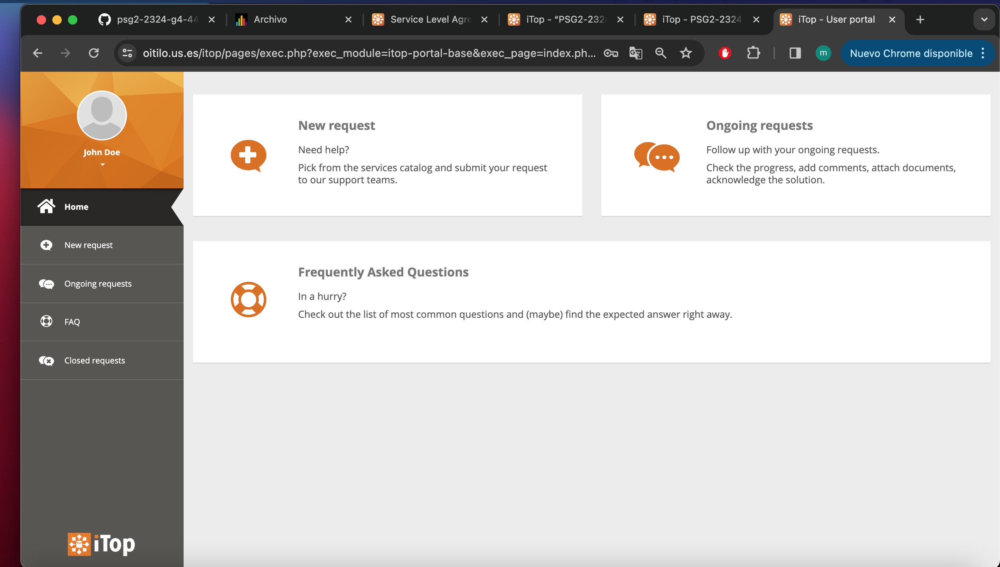
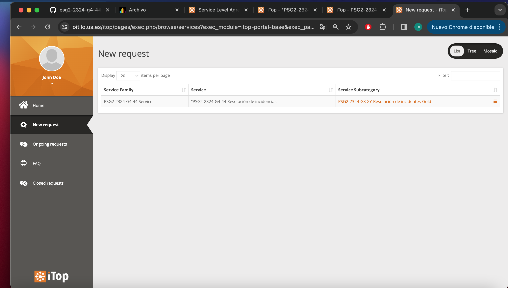
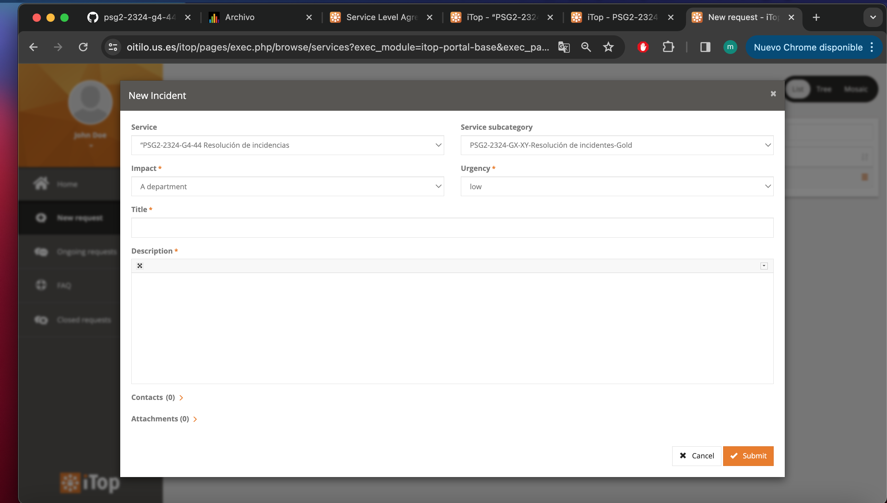

# **Implementacion de iTop para la organización PSG2-2324-G4-44.**

    

---

## Índice

1. [Introducción](#1-introducción)
2. [Contactos, equipo y usuario](#2-contactos-equipo-y-usuarios)
    - [2.1 Contactos y equipo](#21-contactos-y-equipo)
    - [2.2 Usuarios](#22-usuarios)
3. [Gestión de Servicios](#3-gestión-de-servicios)
    - [3.1 Servicios Ofrecidos](#31-servicios-ofrecidos)
    - [3.2 SLA de los servicios ofrecidos](#32-sla-de-los-servicios-ofrecidos)
    - [3.3 Contrato de los servicios ofrecidos](#33-contrato-de-los-servicios-ofrecidos)
4. [Peticiones de usuario e incidentes](#4-peticiones-de-usuario-e-incidentes)
5. [Conclusiones](#5-conclusiones)

---

## **1. Introducción**
Durante el Sprint actual, se ha llevado a cabo un trabajo exhaustivo en el marco de la configuración de iTop, enfocado en optimizar su capacidad para gestionar eficazmente incidentes y solicitudes de los servicios proporcionados por Petclinic. 

Uno de los aspectos fundamentales abordados en este Sprint ha sido la configuración de servicios dentro de iTop. Esto implica la definición detallada de los servicios ofrecidos por Petclinic, así como la creación de subcategorías de servicios para una mejor organización y categorización. Esta estructuración facilita una gestión más eficiente de los servicios y una respuesta ágil a las solicitudes e incidentes.

Otro componente esencial del trabajo realizado ha sido la configuración de acuerdos de nivel de servicio (SLA) y acuerdos de tiempo de servicio (SLT). Esta configuración proporciona un marco para la monitorización y el seguimiento continuo del rendimiento del servicio, permitiendo una mejora continua y una adaptación ágil a las necesidades cambiantes del negocio y de los clientes.

Además, se ha realizado la configuración de contratos para los clientes de Petclinic y la de modelos de entrega dentro de iTop. 

Finalmente, este documento va acompañado de imágenes donde se muestran el proceso y la creación de todos los elementos dentro de iTop, también se proporciona una breve explicación de las dificultades encontradas.

---

## **2. Contactos, equipo y usuario**
### **2.1 Contactos y equipo**
Nuestro grupo tenia creado previamente una organización PSG2-2324-G4-44 dentro de iTop. Este se compone de cinco contactos, uno por cada miembro. Se ha incorporado un nuevo contacto como equipo denominado PSG2-2324-G4-44 Team al que se le han añadido todos los miembros del grupo.

    

### **2.2 Usuarios**
Además de los usuarios de iTop creados para cada miembro del grupo en el Sprint 1, cada grupo tiene acceso a dos usuarios cliente que representan a dos propietarios de clínica y que accederán al portal de usuarios iTop con su propio usuario y contraseña:
PSG2-2324-clinicOwner1-G4-44 y PSG2-2324-clinicOwner2-G4-44

---

## **3. Gestión de Servicios**
### **3.1 Servicios Ofrecidos**
Nuestra organización ha creado dentro de iTop todos los servicios referidos en los criterios de aceptación. La nomenclatura que se ha utilizado es “PSG2-2324-G4-44 nombre-del-servicio”. Una vez creado se deben añadir las subcategorías que correspondan, en este caso solo están disponibles dos: Incident y Service Request.
Esta a su vez también sigue un esquema similar al de los servicios “PSG2-2324-G4-44 – Nombre-de-subcategoría”. Además también irá asociada al menos un contrato por cada cliente.

    

### **3.2 SLA de los servicios ofrecidos**
En primer lugar se han creado las definiciones (SLTs) de los valores de las métricas TTO Y TTR que se van a usar en el SLA asociado a casa plan de precio y a cada cliente de acuerdo a los criterios de aceptación. Como estos se comparten en todas las organizaciones hemos creado una nomenclatura para nuestro grupo “PSG2-2324-G4-44 – Nombre-del-SLT”.

Una vez hecho esto, se ha creado el SLA para cada servicio ofrecido por nuestra organización y el esquema que hemos usado es “PSG2-2324-G4-44-nombreservicio-ZZZ”, ZZZ es el plan de precios concreto en el que se utilizará. Los SLTs creados anteriormente se han asociado a este SLA.

    

### **3.3 Contrato de los servicios ofrecidos**
Como organización hemos creado un contrato de consumidor (Consumer Contract) con al menos una organización cliente por cada uno de los planes ofrecidos por la aplicación Petclinic. 

El contrato consta de una organización que corresponde al cliente y un proveedor del servicio que en este caso es nuestra organización. Además en el contrato se le asociara el servicio junto con su SLA correspondiente. 

Finalmente, hemos definido un Delivery Model, con el nombre de la organización, vinculados a todos los contactos de la organización además del equipo creado nuevamente y asociado con la organización del cliente correspondiente.

    

---

## **4. Peticiones de usuario e incidentes**

Una vez realizado las configuraciones necesarias, la siguiente imagen muestra el portal del usuario disponible a traves del cual podrá realizar las peticiones de usuario e incidencias.

    

Como se puede observar el cliente cuando va a realizar una  petición puede elegir entre el listado de servicios proporcionado por nuestra organización.

    

Este debe de rellenar el formulario detalladamente con los datos de la petición.

    

---

## **5. Conclusiones**
El trabajo realizado durante este Sprint ha sido crucial para fortalecer la capacidad de iTop para soportar la gestión de incidentes y solicitudes de los servicios de Petclinic. Desde la configuración de contratos y servicios hasta la definición de SLAs, SLTs y modelos de entrega, cada aspecto ha sido cuidadosamente abordado para garantizar una gestión de servicios efectiva y eficiente, que cumpla con las expectativas y necesidades tanto de la empresa como de sus clientes. Finalmente, mencionar que no se ha encontrado ninguna dificultad a la hora de realizar la configuración en iTop y se ha podido crear el portal de peticiones del cliente de manera satisfactoria.
---
