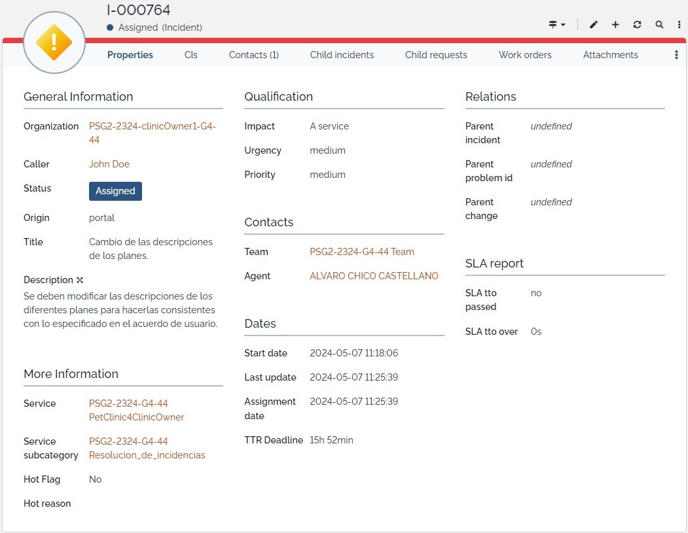
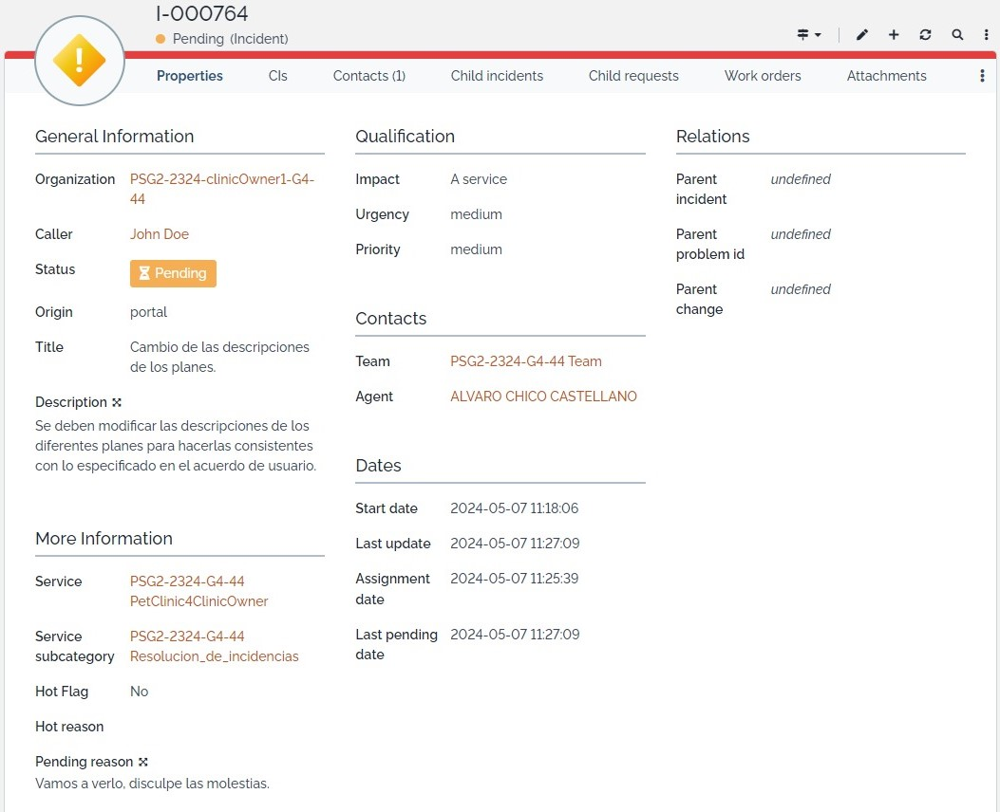
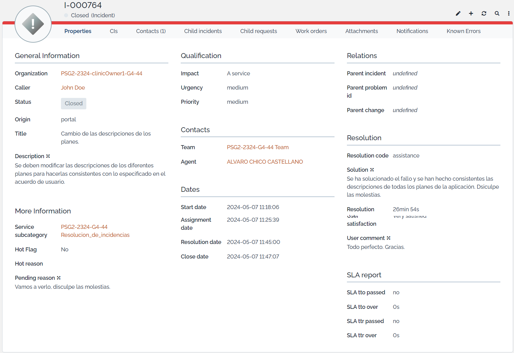
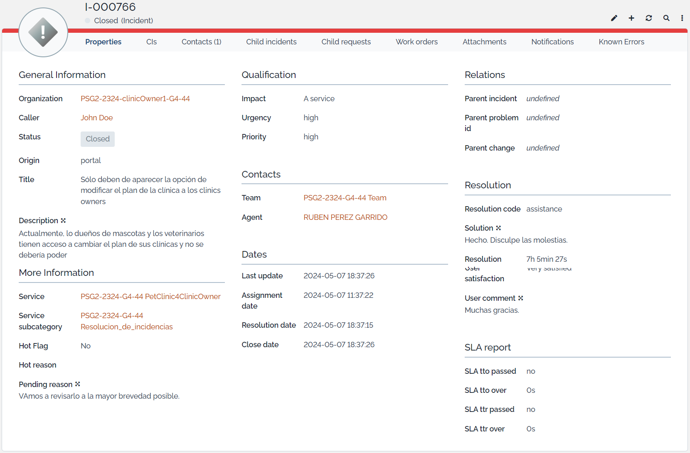

# **Monitorización del Acuerdo de Cliente de PetClinic Services (PSG2-2324-G4-44).**

    

---

## Índice

1. [Introducción](#1-introducción)
2. [Descripción De Los Planes De Precios](#2-descripción-de-los-planes-de-precios)
    - [2.1 Informe](#21-informe)
    - [2.2 Tiempo De Trabajo](#22-tiempo-de-trabajo)
3. [Identificar El Plan Actual](#3-identificar-el-plan-actual)
    - [3.1 Informe](#31-informe)
    - [3.2 Tiempo De Trabajo](#32-tiempo-de-trabajo)
4. [Eliminar La Página "Plan" Para Dueños De Mascotas](#4-eliminar-la-página-plan-para-dueños-de-mascotas)
    - [4.1 Informe](#41-informe)
    - [4.2 Tiempo De Trabajo](#42-tiempo-de-trabajo)
5. [Plan De Actualización A La Clínica 3](#5-plan-de-actualización-a-la-clínica-3)
    - [5.1 Informe](#51-informe)
    - [5.2 Tiempo De Trabajo](#52-tiempo-de-trabajo)
6. [Extensiones Basadas En API](#6-extensiones-basadas-en-api)
    - [6.1 Informe](#61-informe)
    - [6.2 Tiempo De Trabajo](#62-tiempo-de-trabajo)

---

## **1. Introducción**
En el presente informe técnico se expondrá el trabajo efectuado para supervisar los compromisos con el cliente durante el proceso de resolución de las solicitudes que han sido presentadas por los mismos.

El proceso que sigue una petición desde que es realizada hasta que es completada por el equipo es el siguiente:
1. **Creación**: En este punto se puede observar, como información más relevante, el nombre del usuario que ha creado la petición/incidencia, un título identificativo y una descripción más precisa que facilita al equipo comprender y solventar la petición que se presenta.

    

2. **Asignación**: Posteriormente, un miembro del equipo asigna dicha petición a otro miembro del equipo para que este la resuelva. En este caso podemos ver que se ha asignado a "Álvaro Chico Castellano", perteneciente al equipo de de "PSG2-2324-G4-44". Aparecen datos útiles para las estadísticas como son las fechas de comienzo, actualización, asignación y TTR.

    

3. **Pendiente**: Tras la asignación, la petición pasa a estar en un estado "Pendiente", en el que el miembro del equipo al que se le ha asignado la resolución de esta incidencia está trabajando para solventarla.

    

4. **Resuelto**: Una vez el miembro ha completado la petición satisfactoriamente, esta se marca como resuelta. En este punto, el miembro añadirá comentarios a su resolución. Junto a esto, aparecerá un valor temporal que señala el tiempo que ha tomado completar el proceso hasta este punto.

    

5. **Cerrado**: Finalmente, el usuario que creó la petición/incidencia, hará una valoración al respecto, valorando el trabajo y pudiendo dejar un comentario al respecto, y así, se dará por completado satisfactoriamente el proceso de solución de una petición. 

    

---

## **2. Descripción De Los Planes De Precios**
Descripción incidente: La descripción de los planes de precios que se encuentra en la ruta/planes de la aplicación debe ser coherente con la CA.

### **2.1 Informe**
Se han modificado los campos de texto que se muestran al usuario a la hora de visualizar los distintos planes que posee PetClinic con el objetivo de ser coherentes con los valores presentes con el Customer Agreement. Simplemente se han cambiado los valores que se presentan en las distintas secciones de las listas de beneficios de cada plan presentado. Este es el código modificado:

    

### **2.2 Tiempo De Trabajo**
Todos los valores temporales relevantes se pueden ver en la sección "Dates" de la imagen inferior:

    

---

## **3. Identificar El Plan Actual**
Descripción solicitud: El plan de precios actual asociado con una clínica debe mostrarse en la barra de encabezado junto al nombre de usuario que inició sesión.

### **3.1 Informe**
Para esta solicitud, el equipo ha tenido que realizar los siguientes cambios:
- Implementar una función que obtenga el plan del usuario que está utilizando el sistema y la muestre en la barra de navegación. Para que esto funcione, se busca si en la sesión existe algún token JWT con el que se pueda identificar al usuario. Si es el caso, se decodifica dicho token y se obtiene su rol y se hace una llamada a la API para obtener el plan.
- Se ha modificado la llamada a la API para obtener el plan de cada rol. Si el usuario es un propietario (owner), se usará `/api/v1/planOwner` y si es un veterinario (vet), se usará `/api/v1/planVet`.
- Se ha añadido un bloque a la barra de navegación en la que, según el plan del usuario del sistema, aparecerá este con un color u otro, siendo azul para "Platinum", amarillo para "Gold", y gris para otros tipos.
- Finalmente, para que la API para obtener el plan del veterinario funcione, se ha implementado el controlador correspondiente.
Este es el código modificado:

    

### **3.2 Tiempo De Trabajo**
Todos los valores temporales relevantes se pueden ver en la sección "Dates" de la imagen inferior:

    

---

## **4. Eliminar La Página Plan Para Dueños De Mascotas**
Descripción incidente: La página del plan a la que el dueño de una mascota puede acceder usando el enlace "Plan" más a la izquierda en la barra de encabezado (o en la ruta /plan) no tiene sentido, ya que solo los propietarios de clínicas deben administrar los planes de las clínicas.

### **4.1 Informe**
Para este incidente, lo único que ha tenido que realizar el miembro del equipo designado, ha sido eliminar dentro de los elementos de la barra de navegación para el rol de propietario de mascota (owner), el apartado correspodiente a los planes, haciendo que este no pueda acceder a dicha sección. Este es el código modificado:

    

### **4.2 Tiempo De Trabajo**
Todos los valores temporales relevantes se pueden ver en la sección "Dates" de la imagen inferior:

    

---

## **5. Plan De Actualización A La Clínica 3**
Descripción solicitud: El propietario de la Clínica 3 desea actualizar su plan asociado al plan inmediatamente superior.

### **5.1 Informe**
En esta solicitud, hay que cambiar directamente los valores presentes en el data.sql. Para ello localizamos la clínica 3 en el fichero:

`INSERT INTO clinics(id, name, address, telephone, plan, clinic_owner) VALUES (3, 'Clinic 3', 'Av. Reina Mercedes, 70', '955382238', 'BASIC', 2);`

Aquí modificaremos el valor del campo correspondiente a "plan" y lo cambiaremos de 'BASIC' a 'GOLD':

`INSERT INTO clinics(id, name, address, telephone, plan, clinic_owner) VALUES (3, 'Clinic 3', 'Av. Reina Mercedes, 70', '955382238', 'GOLD', 2);`

### **5.2 Tiempo De Trabajo**
Todos los valores temporales relevantes se pueden ver en la sección "Dates" de la imagen inferior:

    

---

## **6. Extensiones Basadas En API**
Descripción solicitud: Agregue funciones que necesiten el uso de al menos dos API externas. Envíe una solicitud diferente para cada API externa. No es necesario integrar las API dentro del código base, pero al menos la GUI debe simular lo que esas API ofrecerían.

### **6.1 Informe**
No procede enseñar código para este punto ya que las APIs fueron implementadas directamente en el sistema.

### **6.2 Tiempo De Trabajo**
En este caso, aparece cortada la información coorespondiente a "Resolution delay", pero se puede confirmar que el valor correspondiente a este campo es de 4h 1min 52s. El resto de valores temporales relevantes se pueden ver en la sección "Dates" de la imagen inferior:

    

