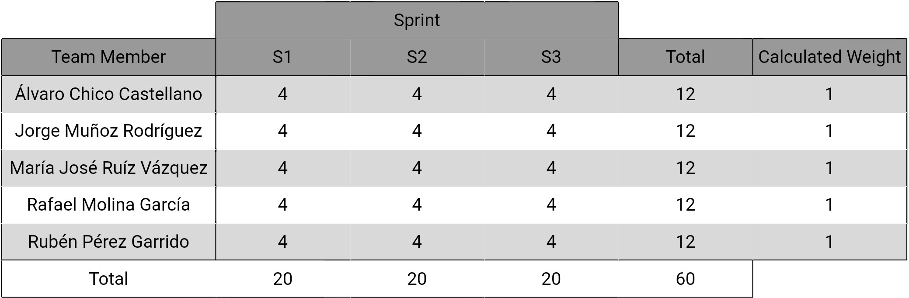

# **Sprint Retrospective**

    

---

## Índice

1. [Introducción](#1-introducción)
2. [Miembros Del Equipo De Trabajo](#2-miembros-del-equipo-de-trabajo)
3. [Evaluación De Los Métodos Del Equipo Y Posibles Mejoras](#3-evaluacion-de-los-metodos-del-equipo-y-posibles-mejoras)
4. [Evaluación De Las Capacidades Y Posibles Mejoras De Los Miembos](#4-evaluacion-de-las-capacidades-y-posibles-mejoras-de-los-miembros)
5. [Plan De Acción](#5-plan-de-accion)
6. [Tabla De Rendimiento](#6-tabla-de-rendimiento)

---

## **1. Introducción**
El siguiente documento detalla la planificación y organización del trabajo para el tercer sprint, estableciendo las tareas a realizar, los responsables de cada tarea y su respectivo tiempo estimado. En él, se presenta una visión clara y estructurada de las actividades que se abordarán durante el período del sprint, lo que facilita la coordinación y el seguimiento del progreso del equipo de desarrollo.

---

## **2. Miembros Del Equipo De Trabajo**
- Álvaro Chico Castellano.
- Jorge Muñoz Rodríguez.
- María José Ruíz Vázquez.
- Rafael Molina García.
- Rubén Pérez Garrido.

---

## **3. Evaluación De Los Métodos Del Equipo Y Posibles Mejoras**
En este apartado se analizarán las mejoras que fueron propuestas por el equipo tras la finalización del segundo sprint, con el objetivo de verificar que se esté avanzando y se tengan en cuenta las ideas que se quisieron imponer. También se verificará que las cuestiones propuestas por el equipo tras el sprint 1 se sigan cumpliendo. Estos son los resultados:
- **Implementar reuniones más frecuentes:** El equipo continuó realizando las reuniones necesarias para cumplir con Scrum. Además de esto, se realizaron reuniones/sesiones de trabajo extras para fomentar el entorno e trabajo y mejorar la progresión del proyecto.
- **Establecer roles y responsabilidades más claros dentro del equipo:** Desde el primer día del sprint 3, el equipo designó correctamente a la persona que se iba a encargar de cubrir el rol de Scrum Master.
- **Establecer objetivos claros y medibles para cada sprint:** Desde el primer día del sprint 3, el equipo compartió sus objetivos individuales para así poder generar un objetivo grupal para esta entrega.
- **Mejorar la gestión del tiempo durante las reuniones y actividades grupales:** Las reuniones y sesiones de trabajo que tuvieron lugar fueron más fructíferas gracias a que todos los miembros del equipo participaron de forma activa, compartiendo sus puntos de vista, favoreciendo así un clima de trabajo más óptimo.
- **Mejorar la repartición de tareas:** Desde el primer día del sprint 3, el equipo realizó una estimación de las tareas y posteriormente una repartición óptima para que todos los distintos miembros del equipo tuvieran que cumplir un número muy similar de puntos de historia de usuario.
- **Mejorar la gestión del tiempo para cumplir con los plazos establecidos:** El equipo trabajó contínuamente para evitar una sobrecarga de trabajo al final del sprint, evitando así una pérdida de calidad en las tareas entregadas.
- **Mejorar la capacidad para recibir y aplicar la retroalimentación de manera constructiva:** Los miembros del equipo supieron apoyarse y ayudarse cuando se encontraban inconvenientes en el desarrollo de alguna de las tareas.
- **Mejorar la revisión de las pull requests:** Siempre que algún miembro ha creado una pull request, otro de los participantes del equipo ha realizado una revisión de dicha pull request y ha tomado la decisión oportuna con tal en el menor tiempo posible, evitando así una sobrecarga de PRs sin aceptar.
- **Mejorar la forma de estimar la complejidad de las tareas para poder trabajar conjuntamente de forma más equitativa:** Durante el sprint planning, el equipo trabajó de forma conjunta para mejorar la estimación de las tareas, evitando así que se asignanses puntos de historia irreales o descompensados.

- **Dejar de depender exclusivamente del Whatsapp como medio de comunicación y comenzar a utilizar herramientas colaborativas más eficientes:** Además de Whatsapp, el equipo utilizó Discord como medio de comunicación para, a parte de compartir información relativa al proyecto, esta plataforma permitió que el equipo pudiese realizar sesiones de trabajo conjuntas para optimizar el trabajo y ayudarnos mutuamente para lograr completar las tareas.
- **Detener la procrastinación y abordar de inmediato los problemas y desafíos que surjan durante el desarrollo del proyecto:** El equipo trabajó de forma conjunta y contínua evitando así generar una sobrecarga al final del sprint y ayudando a en el caso de que algún miembro encontrase un problema.
- **Detener la asignación de tareas sin una comunicación clara sobre las expectativas y los plazos, lo que puede generar confusión y retrasos:** En el sprint planning del sprint 3, el equipo trabajó de forma óptima para que la asignación de las tareas fuese la mejor y todos trabajasen de forma equitativa. Junto a esto, se expresaron los objetivos de cada uno de los miembros para así poder establecer un objetivo común (Completar todas y cada una de las tareas propuestas además de las extras) para el sprint.
- **Evitar tener pull requests mucho tiempo esperando a ser aceptadas:** El equipo mejoró la comunicación a la hora de la realización de las pull request. Esto hizo que menos tareas estuviesen tanto tiempo en la columna de "In Review" y ayudó a hacer un mejor seguimiento del desarrollo del sprint.
- **Asignar tareas del mismo contexto a personas distintas, buscando que cada miembro trabaje enfocado en un mismo marco:** Después de estimar las tareas, los miembros las asignaron de manera que si algún miembro realizaba una tarea relacionada con un contexto presente en otra tarea, se le asignaba esta última tarea. Esto se hacía con el propósito de aprovechar el conocimiento previo del miembro sobre el tema, facilitando así su desarrollo y completitud.
  
---

## **4. Evaluación De Las Capacidades Y Posibles Mejoras De Los Miembos** REPASAR
En este apartado se analizarán las mejoras que fueron propuestas por algunos miembros del equipo tras la finalización del tercer sprint, con el objetivo de que otros integrantes puedan mejorar su rendimiento. Se verificará que se esté avanzando y se hayan tenido en cuenta las ideas que se quisieron imponer. Estos son los resultados:
- asd
- asd

---

## **5. Plan de Acción**
El siguiente plan de acción tiene como objetivo identificar acciones concretas para mejorar el desempeño y la eficiencia del equipo. Se estructura en tres columnas: Start, Stop y Continue Doing. En cada columna, se detallarán las actividades que el equipo debe iniciar, dejar de realizar y mantener, respectivamente. Este plan permitirá al equipo enfocarse en las áreas clave para maximizar su rendimiento y lograr los objetivos establecidos. Todo ello se basará en las propuestas del equipo tras la conclusión del sprint 2, teniendo en cuenta además los resultados de los análisis de los puntos anteriores.
### Start:
- asd
- asd

### Stop:
- asd
- asd

### Continue Doing:
- Mantener los daily meetings para evaluar el progreso del equipo y hacer ajustes según sea necesario.
- Continuar empleando ZenHub para llevar una correcta organización de las tareas.
- Mantener la obligación de que otro miembro del equipo tenga que evaluar el commit antes de poder ser subido.
- Mantener un ambiente de trabajo positivo para promover el crecimiento y el éxito del equipo.
- Establecer roles y responsabilidades más claros y de forma más rápida.
- Optimizar la asignación de tareas considerando la carga de trabajo total mediante la evaluación de la complejidad de cada tarea.
- Mantener el ritmo de revisión de las pull requests.
- Mantener el clima de trabajo fomentando que los miembros trabajen entre ellos para solventar problemas durante el desarrollo.
- Mantener el criterio de asignación de tareas.

---

## **6. Tabla De Rendimiento**
En este punto se aborda la evaluación del desempeño individual en tres pasos: calificación individual, recopilación de puntuaciones y discusión para consensuar las calificaciones finales. Tras una revisión justa del desempeño durante este sprint, se ha decidido asignar a todos los miembros del equipo la misma puntuación final debido a su contribución equitativa al proyecto. Esta es la tabla de rendimiento final para este tercer sprint.

    

